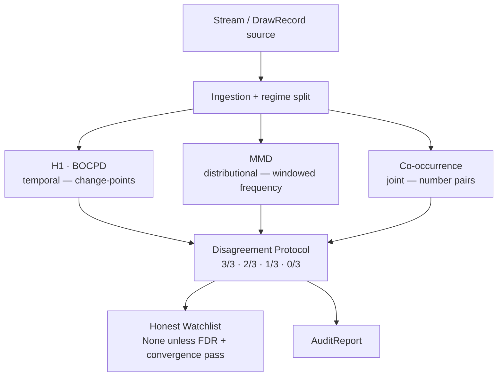
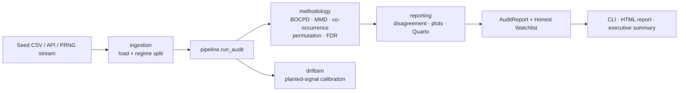

# DriftScope

**English** · [Polski](README.pl.md)

[](https://github.com/Piotr1686/DriftScope/actions/workflows/ci.yml)
[](LICENSE)
[](pyproject.toml)


<p align="center">
  
</p>

<h3 align="center">Twice in its history, EuroJackpot quietly changed its rules.<br>Nobody told the data. <em>The data remembered.</em></h3>

<p align="center">
  DriftScope found <strong>both</strong> changes blind — and stayed silent everywhere nothing happened.<br>
  <em>That silence is the hard part, and the whole point.</em>
</p>

<p align="center">
  <b>958</b> real draws &nbsp;·&nbsp; <b>2 / 2</b> hidden rule-changes found blind &nbsp;·&nbsp; <b>0</b> false alarms on the control &nbsp;·&nbsp; <b>~4.5&nbsp;s</b> to run
</p>

<p align="center">
  📊 <strong><a href="https://piotr1686.github.io/DriftScope/">Live report</a></strong> ·
  📄 <strong><a href="https://piotr1686.github.io/DriftScope/executive_summary.html">Executive summary</a></strong> ·
  🧪 <strong><a href="#try-it-yourself">Try it yourself</a></strong>
</p>

> ⚠️ **This is not a lottery predictor.** The lottery is just a convenient benchmark *with a
> known answer key* — nothing here forecasts a draw, and nothing here could. DriftScope never
> predicts the next number; it audits whether a stream is *still behaving like it should*.

---

## The detective story

A lottery draw is *supposed* to be perfectly uniform — every number equally likely, forever. So is a
random-number generator, a sensor reading noise, or the data feeding a machine-learning model in
production. The hard question isn't "what comes next" — it's **"did this stream quietly stop being
random, and can you prove it *without* fooling yourself into seeing a pattern that was never there?"**

DriftScope is built around that second, harder half. Here it is in three pictures.

### 1 · It finds what's really there

<p align="center">
  
</p>

EuroJackpot expanded its pool of "euro numbers" by rule changes in **2014** and **2022**. We handed
DriftScope the raw stream of numbers — **no dates, no labels, no hint that anything ever changed** —
and asked a single question: *when, if ever, did the distribution shift?* It put its two tallest
spikes almost exactly on the two real changes. The instrument works.

<details>
<summary>🤓 Why the tallest peak isn't actually a rule change (and why that's fine)</summary>

<br>Run blind, BOCPD's single **highest**-confidence change-point is **2015-01-23**, *not* a rule
change — it's a physical aftershock of the 2014 expansion: new euro symbols kept *first appearing*
for months afterwards, so the distribution genuinely kept shifting. The rule-change draws themselves
surface as the first draw containing a "9" (**2014-11-28**, posterior ≈ 0.41) and the first "11"
(**2022-03-29**, ≈ 0.40) — both above the euron alarm threshold (0.33) and both in the top-5. So the
largest peak is a *real* distributional shift, not a spurious one. The detector fires where change
exists and invents none where it doesn't (see picture 2). EuroJackpot is a physical process, not an
ideal RNG — what's genuinely *known* is the rule changes (ex ante) and the invariance of the 1–50
pool. Those are the controls; we never assume perfect uniformity.
</details>

### 2 · …and it stays silent where nothing changed

<p align="center">
  
</p>

The main **1–50** pool was *never* touched in 14 years. Point the exact same detector at it and the
curve is flat — **nothing crosses the alarm line.** This is the expensive half. A smoke alarm that
goes off whenever you make toast is worse than no alarm at all, and most "we found a pattern!" claims
about random data are exactly that toast. DriftScope's core discipline is **not** hallucinating a
signal: when there's no evidence, it says so — an honest *"no evidence"*, not an empty shrug.

### 3 · The same instrument, calibrated on known defects

<p align="center">
  
</p>

To prove the silence above is *calibration* and not *blindness*, we aim the identical battery at
random-number generators whose answer is known. Good generators and two **cryptographic** ones come
back **clear**. Two deliberately broken generators light up — and, crucially, they light up
**differently**: a simple *bias* (one number over-represented) trips two detectors; a *repeating
cycle* trips all three at once. DriftScope tells you not just *that* a stream is broken but *what kind*
of broken it is. → [Full PRNG benchmark ↓](#sensitivity-the-prng-benchmark)

---

> **For whom.** If you own a process that is *supposed* to stay uniform — an RNG, an ML
> training/production feature, a sensor, a process-control stream — DriftScope audits whether it
> drifted, with calibrated false-positive control and an honest "no evidence" when it didn't. The
> lottery above is just the benchmark with a known answer key. See [Beyond the Lottery](#beyond-the-lottery).

## Try it yourself

Requires **Python 3.10**. One command ingests 958 real EuroJackpot draws, runs the three-detector
audit, and prints the verdict:

```bash
pip install -e ".[dev]"          # editable install with dev tools
driftscope run                   # full audit on the bundled 958-draw seed CSV
```

<sub>On Windows 11 / Miniconda, if pip hits an SSL cert error, add
`--trusted-host pypi.org --trusted-host files.pythonhosted.org`.</sub>

Prefer to click rather than install? An **interactive demo** — a detection matrix, an *entropy lens*,
and a real-vs-uniform *Turing test* you can play — runs locally with:

```bash
pip install -e ".[demo]" && streamlit run demo/app.py
```
<!-- TODO: once deployed to Streamlit Community Cloud, link the hosted demo here and in the hero. -->

### What the verdict looks like

`driftscope run` prints a verdict block. On the bundled data (positive control = euro numbers with
known 2014/2022 changes; negative control = the unchanged 1–50 pool):

```text
DriftScope audit — stream verdict:
  POSITIVE CONTROL (euron/BOCPD, full-stream): reject=True;
    top change-points: 2015-01-23 (p=0.47), 2014-11-28 (p=0.41), 2022-03-29 (p=0.40)
  NEGATIVE CONTROL (main 1-50 / 3 pillars, per regime):
    R1 (n=133): 0/3 (no signal); [h1=ok mmd=ok cooccurrence=ok]
    R2 (n=389): 1/3 (single-pillar signal, requires DriftSim power context); [cooccurrence=reject]
    R3 (n=436): 0/3 (no signal); [h1=ok mmd=ok cooccurrence=ok]
  Family B (per-number FDR, benjamini_yekutieli): 0/150 rejected
  WATCHLIST (DoD-5): None (honest null)
```

Read it as: *the detector fires where a real change exists (euro pool), invents nothing on the
control, and abstains (`None`) rather than forcing a verdict.* Full options in [Usage](#usage).

## How it works — three witnesses, one verdict

Think of three expert witnesses, each looking at the same stream through a different lens. One watches
*when* the distribution shifts over time. One watches *whether* the frequencies drift away from
uniform. One watches *which pairs of numbers* show up together more than chance allows. No single one
catches every kind of deviation — **that is the design.** A claim is graded by how many witnesses agree
(3/3 · 2/3 · 1/3 · 0/3) and promoted only when it *also* clears a false-discovery-rate gate.



| Pillar | Family | What it catches | What it is blind to |
|---|---|---|---|
| **H1** (BOCPD) | temporal / global | change-points in the symbol distribution over time | pair structure |
| **MMD** | distributional | windowed frequencies departing from uniform (shifts, trends) | pair structure |
| **Co-occurrence** | joint | over-represented number *pairs* under uniform margins (`pair_corr`) | marginal signal |

The complementarity is **empirical, not asserted**: a pure pair-correlation signal that preserves
every per-number margin is invisible to the marginal detectors (H1, MMD) — their power collapses to
the false-positive rate — and is caught **only** by co-occurrence. Because that whole class of defect
shows up as **1/3, not 3/3**, agreement is treated as *informative*, not as a hard gate.

<details>
<summary>🤓 The blind spots are pinned down by direct tests — and BOCPD doesn't vote alone</summary>

<br>Every claimed blind spot has a test that proves it:
[`test_chi2_blind_to_pair_correlation`](tests/test_driftsim_calibration.py),
[`test_serial_blind_to_pair_corr`](tests/test_permutation_null.py),
[`test_mmd_blind_to_pair_corr`](tests/test_mmd_properties.py), with the catch confirmed in
[`test_detects_planted_pair_corr_showcase`](tests/test_cooccurrence.py). Every class of deviation has
at least one champion detector, so agreement is meaningful.

**Design note.** The H1 pillar is represented by BOCPD, calibrated *per field* (euron 0.33 / main
0.70 reject thresholds, FPR ≈ 0.05). The classical stationarity tests (ADF, KPSS, Welch spectrum,
ACF) run as *diagnostics* — they do **not** vote, which would inflate the pillar's false-positive rate
through correlated sub-tests.
</details>

## The proof: EuroJackpot

A null result ("we found nothing") is only worth something if the instrument can find the things that
*are* there. EuroJackpot is the ideal proving ground because it carries its own answer key — the two
[pictures above](#the-detective-story) are the headline; the numbers behind them:

- **Positive control (euro numbers).** BOCPD, run blind on the full stream, detects change-points
  covering **both** known transitions (2014-11-28, 2022-03-29), both above threshold and in the top-5.
- **Negative control (main 1–50 pool).** Evaluated *within each rule regime* (R1 = 133, R2 = 389,
  R3 = 436 draws) by all three pillars: **R1 0/3 · R2 1/3 · R3 0/3**. The lone R2 flag is **neither
  suppressed nor promoted** — it's classified *"single-pillar, requires power context"*, consistent
  with the ~14% chance that one of three regimes throws a spurious flag at α = 0.05.
- **The rigor gate holds.** A per-number false-discovery-rate correction over **150 hypotheses**
  (50 numbers × 3 regimes, Benjamini–Yekutieli) rejects **0/150**. The honest watchlist returns
  **None**.

<details>
<summary>🤓 Nulls within the power of the test · why we don't hard-gate on ≥2/3</summary>

<br>These nulls are statements *within the power of the test*: R1, at n = 133, is the thinnest
regime, where small per-regime effects (a per-number shift of ~1%) are below detection — so "0/3"
there is a clean control, not a guarantee of exact uniformity. The omnibus tests (chi², gap,
co-occurrence) are reported as separate complementary families, not folded into the per-number count
(`preregistration_v7.md` §5).

**Why not hard-gate on ≥2/3.** A genuine pure-pair signal is visible to **only** co-occurrence, so it
surfaces as **1/3, not 3/3** — a naive "≥2/3 = real" rule would be structurally blind to that whole
class of defects. Instead the watchlist's *primary* gate is the per-number **FDR** (Family B), with
convergence required only at **≥1** pillar: a single-family signal that *also* clears FDR can surface,
while a lone flag without FDR support (the R2 pair) does not. The 1/3 label *routes* ("requires power
context"); it does not dismiss.
</details>

→ Full interactive report (BOCPD curves, per-regime tables, a 10-second animated hook):
**https://piotr1686.github.io/DriftScope/**

## Sensitivity: the PRNG benchmark

The [heatmap above](#3--the-same-instrument-calibrated-on-known-defects) is the story; here is the
table behind it. The **exact same battery** is pointed at generators with a known ground truth — two
well-behaved, two cryptographic, **two real public randomness beacons**, the same generator with two
injected defects, and real EuroJackpot for reference.

```bash
python scripts/prng_benchmark.py          # defaults: n_draws=1500, n_perm=499
```

| Source | Class | Family B (reject/size) | MMD p | Co-occ p | IT (LZ) p | Verdict |
|---|---|---|---|---|---|---|
| MT19937 | good | 0/50 | 0.596 | 0.124 | 0.758 | **clear** |
| Xorshift64 | good | 0/50 | 0.710 | 0.430 | 0.302 | **clear** |
| ChaCha20 | crypto | 0/50 | 0.160 | 0.664 | 0.626 | **clear** |
| AES-CTR-DRBG | crypto | 0/50 | 0.740 | 0.264 | 0.720 | **clear** |
| drand (League of Entropy) | beacon | 0/50 | 0.914 | 0.674 | 0.288 | **clear** |
| NIST Beacon 2.0 | beacon | 0/50 | 0.580 | 0.950 | 0.478 | **clear** |
| MT19937 + bias | **defect** (marginal) | **1/50** | **≤ 0.002** | 0.430 | 0.948 | **FLAG** (narrow) |
| MT19937 + period-truncation | **defect** (short cycle) | **27/50** | **≤ 0.002** | **≤ 0.002** | **≤ 0.002** | **FLAG** (broad) |
| EuroJackpot (main 1–50) | real | 0/50 | 0.864 | 0.952 | 0.698 | **clear** |

The two defects fire **differently, and that contrast is the showcase.** A *marginal bias* is caught
narrowly (per-number binomial + windowed frequency) but **not** co-occurrence, which targets pairs. A
*period-truncation* (a short cycle that freezes the whole distribution) is caught **broadly across all
three pillars at once.** Both good PRNGs, both crypto primitives, both public beacons, and real
EuroJackpot come back **clear**.

The two **beacon** rows answer a fair objection to the crypto rows: *ChaCha20 and AES-CTR-DRBG are
generators we build ourselves, from a seed we choose.* [drand](https://drand.love) (League of Entropy
threshold BLS, 30 s cadence) and the [NIST Randomness Beacon 2.0](https://csrc.nist.gov/Projects/interoperable-randomness-beacons/beacon-20)
(hardware entropy, 60 s pulses) are produced and published by **third parties**, with no seed under
our control — so reproducibility here comes from a **committed digest cache**, not from `BASE_SEED`
(`python scripts/fetch_beacons.py both`). The battery staying silent on entropy it did not manufacture
is a stronger specificity claim than staying silent on entropy it did.

Ethereum's **RANDAO is deliberately absent from this table.** Auditing its mix for uniformity would
test the wrong hypothesis: a validator withholding a block picks one of `2^k` candidate mixes by a
utility defined on *downstream duty assignment*, not on the bits, so the marginal distribution stays
uniform under the attack. RANDAO's manipulability is audited **separately**, through the trace that
withholding actually leaves — the position of missed slots within an epoch.

<details>
<summary>🤓 Reading the p-values · the LZ76 supplement · relation to NIST STS / Dieharder</summary>

<br>Here Family B runs **full-stream** (50 numbers) for parity with the synthetic sources — PRNG
streams have no calendar regimes; the regime-split headline (0/150) above is the canonical EuroJackpot
reading. The p-values are **Monte-Carlo permutation estimates** at `n_perm = 499`, so the smallest
reportable value is the **floor** `1/(n_perm+1) ≈ 0.002` (shown as `≤ 0.002`); non-floor values are
single-run estimates that vary run to run — read the **verdict column**, not the third decimal.

**A supplementary information-theoretic lens.** Beyond the three core pillars, a **Lempel-Ziv 1976**
complexity test (`reporting/information_theory.py`; an order-shuffle null over draw blocks, with a
`bz2` compression cross-check) adds a *sequential* view. It conditions on both the marginal *and* the
within-draw joint, so it is deliberately blind to a marginal bias (the `IT (LZ) p` column stays high
for `+bias`) yet fires sharply on the **period-truncation** defect (a frozen cycle is compressible).
It reads real EuroJackpot as incompressible / clear (p ≈ 0.70). It is a **supplement, not a fourth
Disagreement-Protocol pillar** — that set stays three-way.

**"Clear" means no detected defect within the power of this test** (n = 1500, 50 symbols) — not a
certificate of cryptographic quality. For raw bit-level randomness certification, reach for NIST STS
or Dieharder; DriftScope is *complementary*. Its distinctive additions: a **dedicated detector for
co-occurring pairs**, validation against a **real-world stream with a known ground truth**,
**per-regime** scoping, **pre-registration** of every choice, and explicit **decision abstention**.
</details>

## Reusability: a second real game

The PRNG benchmark proves sensitivity on *synthetic* streams; the reusability claim is sealed on a
**second real game**. *Multi Multi* draws **20 numbers from a pool of 80** (vs EuroJackpot's 5-of-50).
Because every detector reads its pool and draw size from the `DrawRecord` itself, the same battery runs
with **zero code changes** — only the data source differs (`python scripts/multimulti_audit.py`).

After re-calibrating at pool = 80 (MMD false-positive rate ≈ 0.035 over 200 honest-null trials — within
Monte-Carlo error of α = 0.05; BOCPD threshold re-derived to 0.34), the audit reads **clear**: a lone
MMD rejection at p ≈ 0.03 is exactly the **single-pillar (1/3) false positive the Disagreement Protocol
is built to absorb** — expected ≈ 1 test in 20, and *not* a finding without convergence. A structurally
different real game (4× the pool, 4× the draw size), the same calibrated instrument, the same
disciplined silence.

## World Lottery Audit: blind replication on official data

The strongest test yet: **blindly recover *documented* rule changes in games the framework has
never seen**. Powerball (5-of-69) and Mega Millions (5-of-75) histories come straight from the
official NY Open Data portal ([data.ny.gov](https://data.ny.gov)) — 4,488 draws (2002–2026)
carrying **four publicly documented matrix changes**, including a pool *shrink* (Mega Millions
75→70, 2017), a harder target than any expansion (`python scripts/lottery_audit.py`).

| Documented change | BOCPD onset (blind) | Family B contrast | caught |
|---|---|---|---|
| Mega Millions 56→75 (2013-10-22) | **2013-10-22 — day zero** | appeared {57..75} | ✓✓ |
| Mega Millions 52→56 (2005-06-24) | below threshold | appeared {53,54,55,56} | ✓ |
| Mega Millions 75→70 shrink (2017-10-31) | below threshold | **vanished {71..75}** | ✓ |
| Powerball 59→69 (2015-10-07) | near-miss (p = 0.065) | appeared {60..69} | ✓ |

**4/4 documented changes detected, 0 spurious onsets, and the exact matrix delta recovered
symbol-by-symbol.** Two honest findings ride along: the Powerball change peak lands at an
empirical **p = 0.065** — formally *not* significant, and reported as such (Family B carries
the detection instead); and the shrink case exposes a *structural* asymmetry — BOCPD reacts
instantly to a new symbol but is nearly blind to symbol retirement, where only two-sided
Family B has power. The Disagreement Protocol's complementarity argument, previously shown on
synthetic planted signals, **replicates on real, documented ground truth**: every change is
caught, but no single pillar catches all of them.

## Why you can trust it — every claim maps to a file

The value of this project is its honesty, so the trust claims map directly to files and to calibrated
guarantees — not adjectives.

- **"Hallucination" has a precise meaning** — a **Type I error (false positive)**, calibrated by
  Monte-Carlo permutation against a shuffled null down to α ≈ 0.05. Every detector's false-positive
  rate is validated ≈ α (**DoD-2**, `methodology/permutation.py`).
- **A null is an honest "no evidence", not "nothing exists"** — the watchlist returns **`None`** only
  after a pattern fails the gate (FDR correction *and* convergence at ≥ 1 pillar). `None` is deliberate
  **decision abstention** (**DoD-5**, `adaptive/honest_watchlist.py`).
- **Multiplicity is controlled** — family-aware FDR: Benjamini–Hochberg (Family A) / **Benjamini–
  Yekutieli** (Family B, valid under *arbitrary* dependence) over the real hypothesis family
  (**DoD-3**, `methodology/multiple_testing.py`).
- **Choices are frozen before the data is seen** — every statistic, null, threshold and effect-size
  grid lives in `methodology/preregistration_v7.md`; each revision carries a `revision_reason`.
- **Reproducibility is bit-exact in the same pinned environment** — every detector is a *pure function*
  of the stream, seeded from the data contents (a BLAKE2b digest ⊕ a fixed base seed), independent of
  call order; `scripts/archive.py` emits a deterministic SHA-256 manifest (**DoD-6**).

## Beyond the lottery

The engine is a general detector of distributional change in discrete streams, so the lottery is just
the first `DrawRecord` source. The following are **application visions**, not shipped integrations:

1. **Pharma / Analytical Development** *(closest to the author's domain)* — process-stability
   monitoring (granulation, tableting), CPP/CQA drift, PAT data: catch a shift in hardness /
   disintegration / moisture *before* a parameter breaches spec, with an honest null that suppresses
   false OOT alarms.
2. **MLOps — data & concept drift** — audit the gap between training and production distributions with
   proper FDR control instead of ad-hoc thresholds.
3. **FinTech / trading** — regime-shift detection, "random walk" auditing, and manipulation signatures
   (spoofing, wash trading) surfaced by the co-occurrence pillar.

The same pattern extends to cybersecurity (log / traffic drift, C2 beaconing), IoT predictive
maintenance (sensor drift ahead of failure), and regulated gaming (slot-machine RNG / loot-box audits).

**Integration in practice.** Build a `list[DrawRecord]` via `DrawRecord.generic(date, numbers,
pool_size)`, then call `pipeline.run_audit(draws) -> AuditReport`; the verdict lives in
`report.watchlist is None` (clear), `report.family_b.n_reject`, and per-regime
`report.regime_audits[R].verdict.fraction`. A one-call `audit_stream(...)` wrapper and a JSON verdict
are on the [Roadmap](#roadmap).

## Usage

```bash
driftscope run                                # full audit on the bundled 958-draw seed CSV
driftscope run --seed-csv path/to/draws.csv   # audit your own discrete stream
driftscope run --n-perm 1999                  # tune the permutation count (default 999)
driftscope run --hook                         # add the 10-second .webm hook (needs ffmpeg on PATH)
driftscope run --no-figures                   # skip figure generation
```

| Option | Default | Description |
|---|---|---|
| `--seed-csv` | config `DATA_SEED_PATH` | Path to the input seed CSV |
| `--n-perm` | `999` | Permutations for the MMD / co-occurrence nulls |
| `--figures` / `--no-figures` | on | Generate the control-comparison + BOCPD PNGs |
| `--hook` / `--no-hook` | off | Generate the `.webm` hook animation (requires ffmpeg) |
| `--out-dir` | config `ARTIFACTS_DIR` | Output directory for figures |

```bash
quarto render src/driftscope/reporting/report.qmd --to html   # reproduce the full HTML report
python scripts/prng_benchmark.py                              # PRNG sensitivity/specificity matrix
python scripts/multimulti_audit.py                           # second real game (Multi Multi, 20-of-80)
python scripts/lottery_audit.py                              # World Lottery Audit (Powerball + Mega Millions)
python scripts/make_readme_assets.py                         # regenerate the README figures
```

## Performance

| Metric | Value | Conditions |
|---|---|---|
| Full audit | **~4.5 s**, **~220 MB** peak RAM | 958 draws, `n_perm=999`, i5-12500H (CPU-only) |
| Test suite | **296 collected**, CI-green | 294 pass / 2 skip locally (Win11) |
| JIT hot loops | **~2.7×** vs NumPy baseline | permutation PoC (`notebooks/poc_permutation_engine.py`) |

> The ~4 GB RAM figure sometimes quoted is the **budget for the full DriftSim calibration sweep**
> (63 synthetic datasets × all tests × 10⁴ permutations), *not* the headline audit — which, as
> measured, is a few seconds and a couple hundred MB.

## Reference

<details>
<summary><strong>Mini-glossary</strong> — one-line glosses for the jargon (skip if you speak this)</summary>

<br>

- **null / null hypothesis** — the "nothing is wrong" baseline (a stationary, uniform, i.i.d. stream).
  We try to *reject* it; failing to reject = "no evidence of drift".
- **Type I error / false positive / "hallucination"** — flagging drift that isn't there.
- **permutation test** — estimating how surprising the data is by reshuffling it many times; the
  smallest reportable p-value is a *floor* = 1/(permutations + 1).
- **change-point (BOCPD)** — a moment where the distribution shifts; BOCPD = *Bayesian Online
  Change-Point Detection* (Adams–MacKay 2007).
- **MMD** — *Maximum Mean Discrepancy*: a distance between two distributions (observed windowed
  frequencies vs. fresh uniform).
- **co-occurrence** — how often two specific numbers appear *together*, beyond chance.
- **FDR (BH / Benjamini-Yekutieli)** — false-discovery-rate control when testing many hypotheses.
- **regime** — a span of time under one fixed rule set (EuroJackpot has three: R1/R2/R3).
- **3/3 · 2/3 · 1/3 · 0/3** — how many of the three independent detectors agree on a signal.
</details>

<details>
<summary><strong>Architecture &amp; stack rationale</strong></summary>

<br>



CPU-only by design. **Polars** (not pandas) for type-safe, vectorised data handling. **Numba**
`@njit(cache=True)` on the permutation / MMD / co-occurrence hot loops — a measured **~2.7×** over the
NumPy baseline. **Pydantic v2** for validated config, **Typer** for the CLI, **Parquet + Zstd** for
artifacts, **Quarto + Plotly + matplotlib** for the reproducible report. Persistence is fully
file-based (no database layer).
</details>

<details>
<summary><strong>Configuration</strong> — Pydantic Settings v2 from an optional <code>.env</code></summary>

<br>Copy `.env.example` to `.env` and adjust — every key has a sane default, so the framework runs out
of the box.

| Key | Default | Purpose |
|---|---|---|
| `BASE_SEED` | `42` | Global determinism seed; each detector additionally derives its own RNG from a BLAKE2b digest of the data ⊕ base seed, so results are call-order-independent |
| `DATA_SEED_PATH` | `./data/seed/eurojackpot_history.csv` | Bundled seed CSV used by `driftscope run` |
| `ARTIFACTS_DIR` | `./artifacts` | Output directory for figures and the SHA-256 manifest |
| `LOG_LEVEL` | `INFO` | Logging verbosity |
| `SCRAPER_USER_AGENT` | `DriftScope/0.1 (research; …)` | User-Agent for the optional scraper |
| `SCRAPER_REQUEST_TIMEOUT_SEC` | `30` | HTTP request timeout for the scraper |
| `SCRAPER_RATE_LIMIT_DELAY_SEC` | `2` | Polite delay between scraper requests |
| `LOTTO_API_KEY` | *(empty)* | Optional API key for the official lotto source (scraper is a fallback) |
</details>

<details>
<summary><strong>Project structure</strong></summary>

<br>

```
src/driftscope/
├── ingestion/      # seed CSV loader + regime split + PRNG stream adapters (rng_streams.py)
├── methodology/    # the frozen science: BOCPD, MMD, co-occurrence, permutation,
│                   #   recurrence, multiple-testing (BH / Benjamini-Yekutieli),
│                   #   specification curve, block bootstrap + preregistration_v*.md
├── driftsim/       # planted-signal simulator (5 signals × 4 effect sizes) + calibration
├── reporting/      # disagreement protocol, static + interactive plots, PRNG benchmark,
│                   #   information-theory supplement (LZ76), Quarto report
├── adaptive/       # honest watchlist (returns None unless DoD-3 AND DoD-4 pass)
├── pipeline.py     # end-to-end orchestrator: run_audit(draws) -> AuditReport
└── cli.py          # `driftscope run`
scripts/            # archive (SHA-256 manifest), prng_benchmark + multimulti_audit, make_readme_assets
demo/               # Streamlit audit explorer (optional, `pip install -e ".[demo]"`)
tests/              # 279 tests — calibration, invariants, FPR ≤ α, reproducibility, PRNG, info-theory
data/seed/          # eurojackpot_history.csv (958 draws) + multimulti_history.csv (committed)
docs/               # published HTML report + executive summary (GitHub Pages) + assets/
```
</details>

<details>
<summary><strong>Requirements</strong></summary>

<br>

- **Python 3.10** (`>=3.10,<3.11`) — pinned for the verified Numba toolchain.
- **Compute core:** `numpy>=2.2`, `numba==0.65.1` (pinned — verified Win11 + numpy 2.x), `joblib`.
- **Statistics:** `statsmodels`, `scipy`, `scikit-learn`, `ruptures`.
- **Data / config:** `polars` (not pandas), `pyarrow` (Parquet + Zstd), `pydantic` v2, `pydantic-settings`.
- **CLI / viz:** `typer` + `click`, `matplotlib`, `plotly`.
- **Scraper / crypto:** `httpx`, `selectolax`, `tenacity`, `cryptography` (ChaCha20 / AES-CTR keystreams).
- **Dev extras** (`.[dev]`): `pytest`, `hypothesis`, `ruff`, `mypy`. **Demo extra** (`.[demo]`): `streamlit`.

The full pinned set lives in [`pyproject.toml`](pyproject.toml). CPU-only — no GPU required.
</details>

<details>
<summary><strong>Definition of Done</strong></summary>

<br>

| DoD | Validated by | Criterion |
|---|---|---|
| DoD-1 | BOCPD on euron vs main | detects 2014/2022 pool changes; clean on 1–50 negative control |
| DoD-2 | `methodology/permutation.py` | FPR ≤ α = 0.05 ± MC error under a shuffled null |
| DoD-3 | `methodology/multiple_testing.py` | family-aware FDR (BH / Benjamini-Yekutieli) |
| DoD-4 | `reporting/disagreement.py` | every signal classified 3/3 · 2/3 · 1/3 · 0/3 |
| DoD-5 | `adaptive/honest_watchlist.py` | returns `None` when the FDR + convergence gate fails |
| DoD-6 | `core/seeds.py` + manifest | re-run in the same pinned environment is bit-identical |
</details>

## Roadmap

All items below are **planned / exploratory** — none is shipped:

- a **streaming** MMD detector over continuous-valued data — a bridge to sensor / financial data;
- an online mode with a forgetting factor (windowed BOCPD) — a bridge to live streams;
- a streaming adapter (Kafka / Redpanda) — the pipeline is batch today;
- a PyPI package with a one-call `audit_stream(...)` API returning a JSON verdict;
- a small FastAPI service exposing that verdict;
- an arXiv note with a full power analysis and a comparison to NIST STS.

## License

[MIT](LICENSE).

## About the author

Built solo by **Piotr Łazowski** — an interdisciplinary R&D / statistical-research engineer working at
the intersection of **pharmaceutical analytical development** and **AI/ML**. The same instinct that
flags an out-of-spec drift in a tableting process before it breaches a limit is what DriftScope
formalises for any discrete stream. It is a portfolio project demonstrating end-to-end
statistical-software engineering: methodology design, calibration, reproducibility, and delivery. ·
GitHub: [@Piotr1686](https://github.com/Piotr1686)
