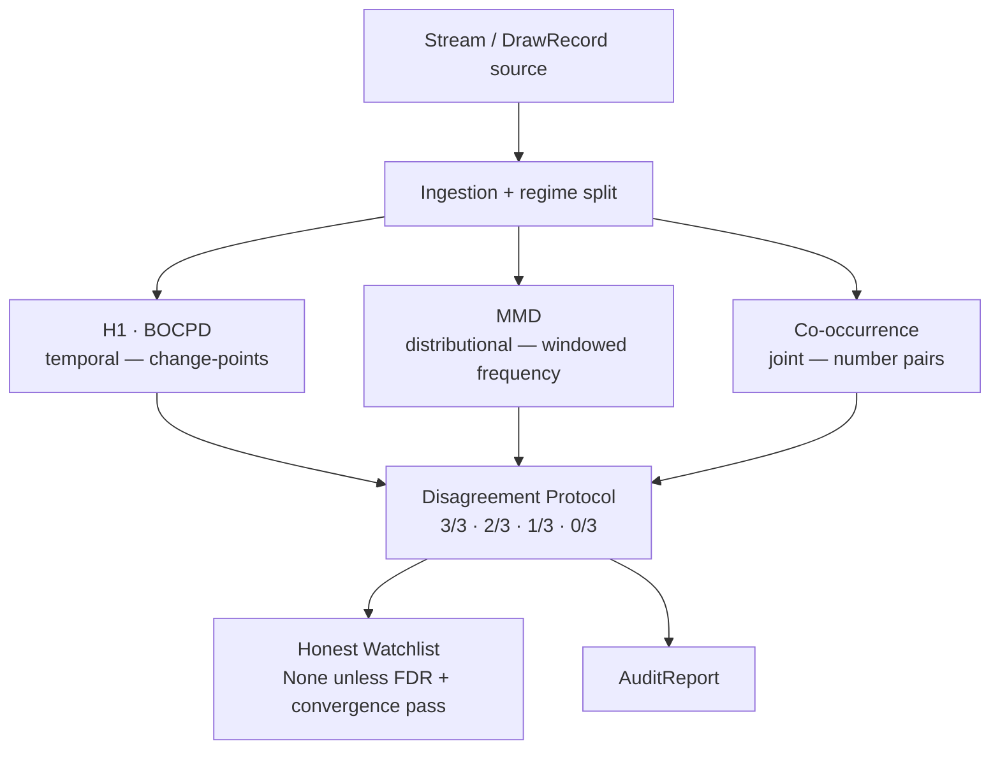
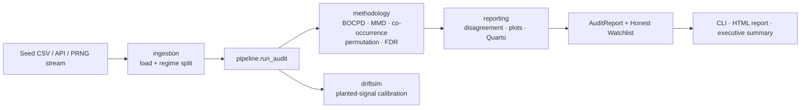

# DriftScope

[](https://github.com/Piotr1686/DriftScope/actions/workflows/ci.yml)
[](LICENSE)
[](pyproject.toml)

**A statistical instrument that detects when a stream of "random" data quietly stops being
random — and, just as importantly, stays silent when it hasn't.**

📊 **Live report:** https://piotr1686.github.io/DriftScope/ ·
📄 **Executive summary (1-page):** https://piotr1686.github.io/DriftScope/executive_summary.html ·
🧪 **Interactive demo:** `pip install -e ".[demo]" && streamlit run demo/app.py`

---

## The 30-second version

Imagine a process that is *supposed* to be perfectly uniform — a lottery draw, a random-number
generator inside a cryptographic library, a sensor that should read pure noise, the gap between
your model's training data and the data it sees in production. How would you *prove* it drifted?
And — the harder half of the question — how would you keep yourself from "discovering" a drift
that was never there? Stare at enough numbers and the human brain will always find a pattern.

That second failure mode is the expensive one. A detector that cries wolf is worse than no
detector at all. **DriftScope is built around the discipline of *not* hallucinating a signal.**
It is a methodology, not a crystal ball: it never tries to predict the next number — it audits
whether the distribution is still behaving, and reports the *absence* of evidence as honestly as
its presence.

> ⚠️ **This is not a lottery predictor.** The lottery is a convenient benchmark with a known
> answer key — nothing here forecasts a draw, and nothing here could.

## Highlights

- 🎯 **A built-in answer key.** Audited on **958 real EuroJackpot draws (2012–2026)**, a process
  whose rules are *known* to have changed twice (the euro-number pool, in 2014 and 2022) while the
  main 1–50 pool *never* changed — a natural **positive *and* negative control** in one dataset.
- ✅ **It finds the real change and invents none.** Detects change-points at the known transitions
  (**2014-11-28**, **2022-03-29**); on the unchanged 1–50 pool it returns **0 findings**, an
  *honest null* — not an empty list, a deliberate "no evidence" (see [§ Why you can trust it](#why-you-can-trust-it)).
- 🔬 **Three independent detectors that must agree.** A *Disagreement Protocol* over three
  mathematically non-overlapping families — each blind to what the others catch.
- 🧪 **The instrument is calibrated, and you can prove it.** Point the same battery at PRNGs with
  a known ground truth: it **clears two crypto-grade generators**, **flags two planted defects** —
  and the *pattern* of which detectors fire tells you the *kind* of defect.
- 📐 **Pre-registered & reproducible.** Every statistical choice is frozen *before* looking at
  results (`preregistration_v7.md`); a cold-machine re-run is **bit-identical** (SHA-256 manifest).
- ⚡ **Fast & light.** The full audit runs in **~4.5 s** and peaks at **~210 MB RAM** on a laptop
  CPU. **276 passing tests** (CI-green on Linux).

---

## How it works — three detectors that must agree

Think of three independent expert witnesses, each looking at the same stream through a different
lens. One watches *when* the distribution shifts over time. One watches *whether* the frequencies
drift away from uniform. One watches *which pairs of numbers* show up together more than chance
allows. None of them can see what the others see — and that is the point. A claim is only trusted
to the degree the witnesses **agree** (a signal is graded 3/3 · 2/3 · 1/3 · 0/3).



| Pillar | Family | What it catches | What it is blind to |
|---|---|---|---|
| **H1** (BOCPD) | temporal / global | change-points in the symbol distribution over time | pair structure |
| **MMD** | distributional | windowed frequencies departing from uniform (shifts, trends) | pair structure |
| **Co-occurrence** | joint | over-represented number *pairs* under uniform margins (`pair_corr`) | marginal signal |

The non-redundancy is provable, not asserted: a pure pair-correlation signal is invisible to
H1/MMD whenever the per-number margins are preserved (their power collapses to the false-positive
rate), and is caught **only** by co-occurrence. Every class of deviation has at least one champion
detector, and no two detectors overlap — so agreement is meaningful.

> **Design note.** The H1 pillar is represented by BOCPD (Bayesian Online Change-Point Detection,
> Adams–MacKay 2007), calibrated *per field*. The classical stationarity tests (ADF, KPSS, Welch
> spectrum, ACF) run as *diagnostics* — they do **not** vote, which would inflate the pillar's
> false-positive rate through correlated sub-tests.

## The proof — EuroJackpot

A null result ("we found nothing") is only worth something if the instrument can find the things
that *are* there. EuroJackpot is the ideal proving ground because it carries its own answer key.

- **Positive control (euro numbers).** The pool of euro numbers was expanded by rule changes in
  2014 and 2022. BOCPD, run blind on the full stream, detects change-points covering **both** known
  transitions — the first draw containing a "9" on **2014-11-28** (posterior ≈ 0.41) and the first
  "11" on **2022-03-29** (≈ 0.40). The detector fires where a real change exists.
- **Negative control (main 1–50 pool).** This pool was never touched. Evaluated *within each rule
  regime* (R1 = 133, R2 = 389, R3 = 436 draws) by all three pillars, the verdict is
  **R1 0/3 · R2 1/3 · R3 0/3**. The lone single-pillar flag in R2 (one number pair) is **not
  suppressed and not promoted** — it is classified as *"single-pillar, requires power context"*,
  consistent with the ~14% chance that one of three regimes throws a spurious flag at α = 0.05.
- **The rigor gate holds.** A per-number false-discovery-rate correction over **150 hypotheses**
  (50 numbers × 3 regimes, Benjamini–Yekutieli) rejects **0/150**. The honest watchlist returns
  **None**.

The framework confirms the known signal and proposes nothing where there is no convergent
evidence. *Quasi-ground-truth caveat: EuroJackpot is a physical process, not an ideal RNG. What is
genuinely known is the* rule changes *(ex ante) and the invariance of the 1–50 pool — and those are
the controls, not an assumption of perfect uniformity.*

→ Full interactive report (BOCPD curves, per-regime tables, a 10-second animated hook):
**https://piotr1686.github.io/DriftScope/**

## Sensitivity — the same audit on PRNGs

To show the silence on EuroJackpot is *calibration* and not *blindness*, the **exact same battery**
is pointed at random-number generators with a known ground truth — two well-behaved generators, two
cryptographic ones, the same generator with two deliberately injected defects of different kinds,
and real EuroJackpot for reference (`python scripts/prng_benchmark.py`, n = 1500):

| Source | Class | Family B (reject/size) | MMD p | Co-occ p | IT (LZ) p | Verdict |
|---|---|---|---|---|---|---|
| MT19937 | good | 0/50 | 0.595 | 0.055 | 0.780 | **clear** |
| Xorshift64 | good | 0/50 | 0.700 | 0.320 | 0.315 | **clear** |
| ChaCha20 | crypto | 0/50 | 0.140 | 0.490 | 0.635 | **clear** |
| AES-CTR-DRBG | crypto | 0/50 | 0.740 | 0.225 | 0.710 | **clear** |
| MT19937 + bias | **defect** (marginal) | **1/50** | **0.005** | 0.465 | 0.970 | **FLAG** (narrow) |
| MT19937 + period-truncation | **defect** (short cycle) | **27/50** | **0.005** | **0.005** | **0.005** | **FLAG** (broad) |
| EuroJackpot (main 1–50) | real | 0/50 | 0.885 | 0.940 | 0.700 | **clear** |

The two defects fire **differently, and that contrast is the showcase.** A *marginal bias* (one
number over-represented) is caught narrowly — its per-number binomial breaks (Family B) and its
windowed frequency departs from uniform (MMD) — but **not** co-occurrence, which targets pairs, not
marginals. A *period-truncation* (a short cycle that repeats, freezing the whole distribution) is
caught **broadly across all three pillars at once**. The framework therefore reports not just
*whether* a stream is defective but *what kind* of defect it is. Both good PRNGs, **both** crypto
primitives (stream *and* block cipher), and real EuroJackpot all come back **clear**.

**A supplementary information-theoretic lens.** Beyond the three core pillars, a **Lempel-Ziv 1976**
complexity test (`reporting/information_theory.py`; an order-shuffle null over draw blocks, with a
`bz2` compression-ratio cross-check) adds a *sequential* view. It conditions on both the marginal
*and* the within-draw joint, so it is deliberately blind to a marginal bias (the `IT (LZ) p` column
stays high for `+bias`) yet fires sharply on the **period-truncation** defect (a frozen cycle is
compressible). It reads real EuroJackpot as incompressible / clear (**p ≈ 0.70**, and clear in
every regime). It is a **supplement, not a fourth Disagreement-Protocol pillar** — that set stays
three-way.

> **How this relates to NIST STS / Dieharder.** DriftScope is *complementary* to mature randomness
> suites, not a replacement. Its distinctive additions are a **dedicated detector for co-occurring
> pairs**, validation against a **real-world stream with a known ground truth**, **per-regime**
> scoping, **pre-registration** of every choice, and explicit **decision abstention** (an honest
> "no evidence" rather than a forced verdict). For raw bit-level randomness certification, reach for
> NIST STS or Dieharder; for *framework-level, ground-truth-validated drift auditing*, reach here.

## Reusability — a second real-world game (Multi Multi)

The PRNG benchmark proves sensitivity on *synthetic* streams; the reusability claim is sealed on a
**second real game**. *Multi Multi* draws **20 numbers from a pool of 80** (vs EuroJackpot's 5-of-50).
Because every detector reads its pool and draw size from the `DrawRecord` itself, the same battery
runs with **zero code changes** — only the data source differs (`python scripts/multimulti_audit.py`,
the most recent 2,000 of 16,827 draws, 1996–2026). After re-calibrating the detectors at pool = 80
(MMD false-positive rate = **0.035** over 200 honest-null trials, `scripts/calibrate_mmd_pool.py`;
BOCPD threshold re-derived to **0.34**), the audit reads **clear**: BOCPD, Family B (**0/80**),
co-occurrence and the LZ supplement all silent. A lone MMD rejection at p ≈ 0.03 is exactly the
**single-pillar (1/3) false positive the Disagreement Protocol is built to absorb** — expected ≈ 1
test in 20, and *not* a finding without convergence. A structurally different real game (4× the pool,
4× the draw size), the same calibrated instrument, the same disciplined silence.

## Why you can trust it

The value of this project is its honesty, so the trust claims map directly to files and to
calibrated guarantees — not adjectives.

- **"Hallucination" has a precise meaning.** Throughout, *hallucination* = a **Type I error
  (false positive)**, calibrated by Monte-Carlo permutation against a shuffled null down to
  α ≈ 0.05. Every detector's false-positive rate is validated ≈ α (**DoD-2**,
  `methodology/permutation.py`); the BOCPD reject threshold is calibrated *per field*.
- **A null is an honest "no evidence", not "nothing exists".** The watchlist returns **`None`**
  only after a pattern fails **both** gates — the FDR correction (q ≤ α) *and* convergence across
  pillars. `None` is deliberate **decision abstention** ("insufficient grounds"), distinct from an
  empty result, and distinct from extrapolation (**DoD-5**, `adaptive/honest_watchlist.py`).
- **Multiplicity is controlled.** Family-aware FDR — Benjamini–Hochberg / **Benjamini–Yekutieli**
  (the latter valid under the negative dependence of the 5/50 counts) — over the real hypothesis
  family (**DoD-3**, `methodology/multiple_testing.py`).
- **Choices are frozen before the data is seen.** Every statistic, null, threshold and effect-size
  grid lives in `methodology/preregistration_v7.md`. Each revision carries a `revision_reason`,
  explicitly split into *clean* vs *data-informed* — the §0 discipline.
- **Reproducibility is bit-exact.** Every detector is a *pure function* of the stream; the RNG is
  seeded from the data contents (⊕ `BASE_SEED`), independent of call order. `scripts/archive.py`
  emits a deterministic SHA-256 manifest, so a cold-machine re-run is bit-identical (**DoD-6**).

When the docs say the framework "does not hallucinate", read it precisely: *within the power of the
test, at α = 0.05 and under the model's assumptions.* It is a calibrated error budget, not an
absolute guarantee — and saying so is the whole point.

## Architecture



**Stack rationale.** CPU-only by design. **Polars** (not pandas) for type-safe, vectorised data
handling. **Numba** `@njit(cache=True)` on the permutation / MMD / co-occurrence hot loops — a
measured **~2.7×** over the NumPy baseline on the permutation PoC (`notebooks/poc_permutation_engine.py`),
with the O(N²) kernels benefiting more. **Pydantic v2** for validated config, **Typer** for the
CLI, **Parquet + Zstd** for artifacts, **Quarto + Plotly + matplotlib** for the reproducible
report. Persistence is fully file-based (no database layer).

## Performance at a glance

| Metric | Value | Conditions |
|---|---|---|
| Full audit | **~4.5 s**, **~210 MB** peak RAM | 958 draws, `n_perm=999`, i5-12500H (CPU-only) |
| Test suite | **276 passing** (+2 skipped) | 278 collected; CI-green on Ubuntu / Python 3.10 |
| JIT hot loops | **~2.7×** vs NumPy baseline | permutation PoC (`notebooks/poc_permutation_engine.py`) |

> The ~4 GB RAM figure sometimes quoted for DriftScope is the **budget for the full DriftSim
> calibration sweep** (63 synthetic datasets × all tests × 10⁴ permutations), *not* the headline
> audit — which, as measured above, is a few seconds and a couple hundred MB.

## What I built

A single-author, end-to-end research framework — from data acquisition to a published report:

- **Ingestion** — resilient scraper (`httpx` + `selectolax` + `tenacity`) with a 3-tier fallback,
  regime splitter on the pre-registered rule boundaries, and PRNG stream adapters (MT19937,
  Xorshift64, ChaCha20, AES-CTR-DRBG) with unbiased rejection sampling and injectable defects.
- **Methodology** — BOCPD (Adams–MacKay) with a corrected message-passing recursion and per-field
  threshold calibration; two-sample **MMD** (Gretton, Gaussian-RBF, median heuristic); a
  **co-occurrence** test with a *curveball* swap-randomisation null preserving both margins;
  permutation and moving-block-bootstrap nulls; family-aware FDR; a 9-point specification curve.
- **DriftSim** — an honest uniform null generator plus a planted-signal simulator (5 signal classes
  × 4 effect sizes) and the sensitivity/specificity calibration harness.
- **Reporting & delivery** — the Disagreement Protocol, static (matplotlib) + interactive (Plotly)
  figures, a 10-second `.webm` hook animation, a Lempel-Ziv 1976 information-theoretic supplement, a
  reproducible Quarto report, a Streamlit demo, a Typer CLI, a SHA-256 reproducibility manifest, and
  GitHub Actions CI (ruff + mypy `--strict` + pytest).

## Beyond the lottery — where this transfers

The engine is a general detector of distributional change in discrete streams, so the lottery is
just the first `DrawRecord` source. The following are **application visions**, not shipped
integrations:

1. **Pharma / Analytical Development** *(closest to the author's domain)* — process-stability
   monitoring (granulation, tableting), CPP/CQA drift, PAT data: catch a distributional shift in
   hardness / disintegration / moisture *before* a parameter breaches spec, with an honest null that
   suppresses false OOT alarms.
2. **MLOps — data & concept drift** — audit the gap between training and production distributions
   with proper FDR control instead of ad-hoc thresholds.
3. **FinTech / trading** — regime-shift detection, "random walk" auditing, and manipulation
   signatures (spoofing, wash trading) via the co-occurrence pillar.
4. **Cybersecurity** — drift in network traffic / logs, C2 beaconing, co-occurrence anomalies, and
   LZ-based structure in supposedly random traffic.
5. **IoT / Industry 4.0** — sensor drift ahead of failure for predictive maintenance, with fewer
   false alarms.
6. **Regulated gaming** — slot-machine RNG audits and loot-box drop-rate compliance.

## Quickstart

Requires **Python 3.10**.

```bash
# install (editable, with dev tools)
pip install -e ".[dev]"
# On Windows 11 / Miniconda, if pip hits an SSL cert error, add:
#   --trusted-host pypi.org --trusted-host files.pythonhosted.org

# run the full audit on the bundled seed CSV (958 draws) and print the verdict
driftscope run

# options (n_perm defaults to 999; figures on, hook off)
driftscope run --n-perm 999 --hook          # add the .webm hook animation (needs ffmpeg)
driftscope run --seed-csv path/to/draws.csv  # audit your own stream
```

Reproduce the full HTML report (needs the Quarto CLI):

```bash
quarto render src/driftscope/reporting/report.qmd --to html
```

Explore interactively — a detection matrix, the LZ76 *entropy lens*, and a real-vs-uniform
Turing test:

```bash
pip install -e ".[demo]"
streamlit run demo/app.py
```

## Project layout

```
src/driftscope/
├── ingestion/      # seed CSV loader + regime split + PRNG stream adapters (rng_streams.py)
├── methodology/    # the frozen science: BOCPD, MMD, co-occurrence, permutation,
│                   #   recurrence, multiple-testing (BH / Benjamini-Yekutieli),
│                   #   specification curve, block bootstrap + preregistration_v*.md
├── driftsim/       # planted-signal simulator (5 signals × 4 effect sizes) + calibration
├── reporting/      # disagreement protocol, static + interactive plots, PRNG benchmark,
│                   #   information-theory supplement (LZ76), Quarto report
├── adaptive/       # honest watchlist (returns None unless DoD-3 AND DoD-4 pass)
├── pipeline.py     # end-to-end orchestrator: run_audit(draws) -> AuditReport
└── cli.py          # `driftscope run`
scripts/            # archive (SHA-256 manifest), prng_benchmark + multimulti_audit (reusability)
demo/               # Streamlit audit explorer (optional, `pip install -e ".[demo]"`)
tests/              # 278 tests — calibration, invariants, FPR ≤ α, reproducibility, PRNG, info-theory
data/seed/          # eurojackpot_history.csv (958 draws, committed)
docs/               # published HTML report + executive summary (GitHub Pages)
```

## Definition of Done

| DoD | Validated by | Criterion |
|---|---|---|
| DoD-1 | BOCPD on euron vs main | detects 2014/2022 pool changes; clean on 1–50 negative control |
| DoD-2 | `methodology/permutation.py` | FPR ≤ α = 0.05 ± MC error under a shuffled null |
| DoD-3 | `methodology/multiple_testing.py` | family-aware FDR (BH / Benjamini-Yekutieli) |
| DoD-4 | `reporting/disagreement.py` | every signal classified 3/3 · 2/3 · 1/3 · 0/3 |
| DoD-5 | `adaptive/honest_watchlist.py` | returns `None` when DoD-3/4 fail |
| DoD-6 | `core/seeds.py` + manifest | cold-machine re-run is bit-identical |

## Roadmap

All items below are **planned / exploratory** — none is shipped:

- a continuous-stream detector (Gaussian-kernel MMD) — a bridge to sensor / financial data;
- an online mode with a forgetting factor (windowed BOCPD) — a bridge to live streams;
- a streaming adapter (Kafka / Redpanda) — explicitly *planned*; the pipeline is batch today;
- a PyPI package with a one-call `audit_stream(...)` API;
- a small FastAPI service returning a JSON verdict (`{verdict, regime, timestamp}`);
- an arXiv note with a full power analysis and a comparison to NIST STS.

## About the author

Built solo by **Piotr Łazowski** — an interdisciplinary R&D / statistical-research engineer working
at the intersection of **pharmaceutical analytical development** and **AI/ML**. DriftScope is a
portfolio project demonstrating end-to-end statistical-software engineering: methodology design,
calibration, reproducibility, and delivery. · GitHub: [@Piotr1686](https://github.com/Piotr1686)

## License

[MIT](LICENSE).
