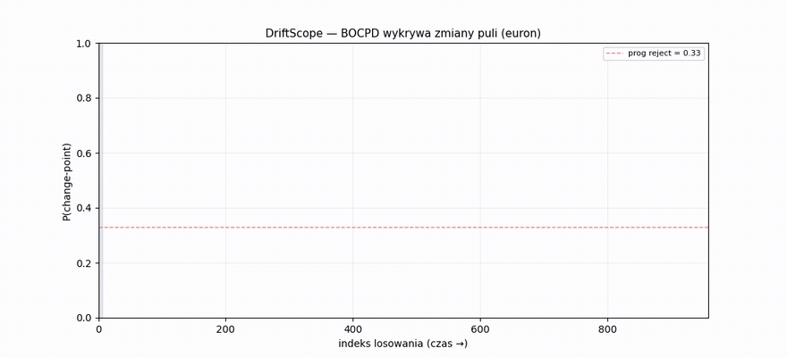
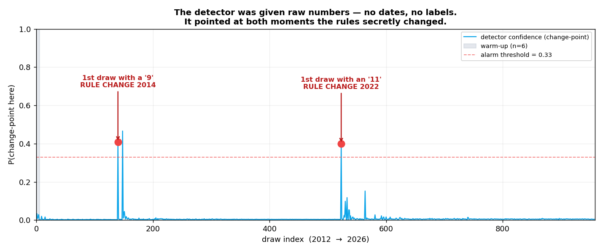
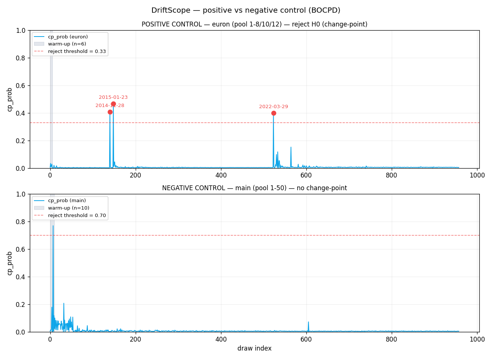
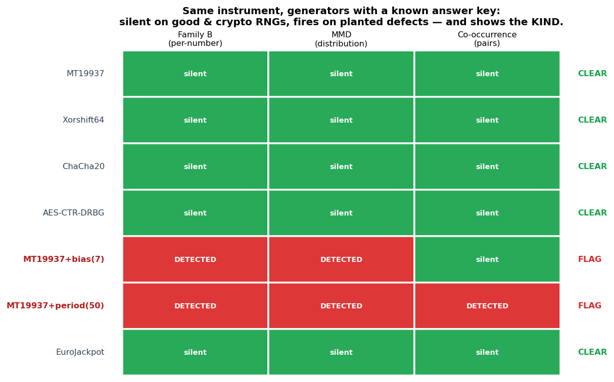
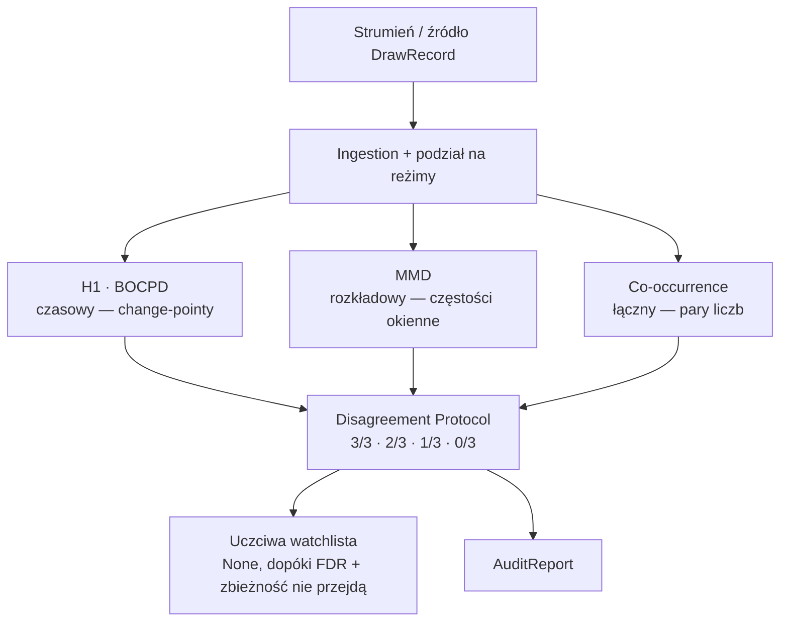
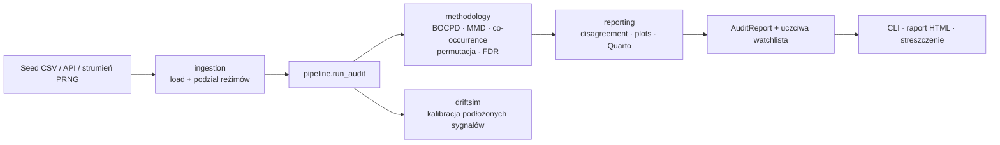

# DriftScope

[English](README.md) · **Polski**

[](https://github.com/Piotr1686/DriftScope/actions/workflows/ci.yml)
[](LICENSE)
[](pyproject.toml)


<p align="center">
  
</p>

<h3 align="center">Dwa razy w swojej historii EuroJackpot po cichu zmienił reguły.<br>Nikt nie powiedział o tym danym. <em>Dane zapamiętały.</em></h3>

<p align="center">
  DriftScope znalazł <strong>obie</strong> zmiany na ślepo — i milczał wszędzie tam, gdzie nic się nie wydarzyło.<br>
  <em>To milczenie jest trudną częścią i całym sensem.</em>
</p>

<p align="center">
  <b>958</b> prawdziwych losowań &nbsp;·&nbsp; <b>2 / 2</b> ukryte zmiany reguł wykryte na ślepo &nbsp;·&nbsp; <b>0</b> fałszywych alarmów na kontroli &nbsp;·&nbsp; <b>~4.5&nbsp;s</b> działania
</p>

<p align="center">
  📊 <strong><a href="https://piotr1686.github.io/DriftScope/">Raport na żywo</a></strong> ·
  📄 <strong><a href="https://piotr1686.github.io/DriftScope/executive_summary.html">Streszczenie wykonawcze</a></strong> ·
  🧪 <strong><a href="#wypróbuj-sam">Wypróbuj sam</a></strong>
</p>

> ⚠️ **To nie jest predyktor loterii.** Loteria to tylko wygodny benchmark *ze znanym kluczem
> odpowiedzi* — nic tutaj nie prognozuje losowania i nic tutaj nie mogłoby tego robić. DriftScope
> nigdy nie przewiduje następnej liczby; audytuje, czy strumień *nadal zachowuje się tak, jak powinien*.

---

## Historia detektywistyczna

Losowanie loterii *powinno* być idealnie jednorodne — każda liczba tak samo prawdopodobna, na zawsze.
Tak samo generator liczb losowych, czujnik odczytujący szum albo dane karmiące model uczenia
maszynowego na produkcji. Trudne pytanie nie brzmi „co będzie następne" — brzmi: **„czy ten strumień
po cichu przestał być losowy i czy potrafisz to udowodnić *nie oszukując samego siebie*, że widzisz
wzorzec, którego nigdy nie było?"**

DriftScope jest zbudowany wokół tej drugiej, trudniejszej połowy. Oto ona w trzech obrazkach.

### 1 · Znajduje to, co naprawdę istnieje

<p align="center">
  
</p>

EuroJackpot rozszerzył pulę „euronumerów" zmianami reguł w **2014** i **2022**. Podaliśmy DriftScope
surowy strumień liczb — **bez dat, bez etykiet, bez cienia sugestii, że cokolwiek się zmieniło** —
i zadaliśmy jedno pytanie: *kiedy, jeśli w ogóle, rozkład się przesunął?* Postawił swoje dwa najwyższe
piki niemal dokładnie na dwóch prawdziwych zmianach. Instrument działa.

<details>
<summary>🤓 Dlaczego najwyższy pik wcale nie jest zmianą reguł (i dlaczego to w porządku)</summary>

<br>Na ślepo najwyższy change-point BOCPD to **2015-01-23**, *nie* zmiana reguł — to fizyczny
aftershock rozszerzenia z 2014: nowe symbole euro *pierwszy raz pojawiały się* przez kolejne miesiące,
więc rozkład faktycznie wciąż się przesuwał. Same losowania ze zmianą reguł wypływają jako pierwsze
losowanie zawierające „9" (**2014-11-28**, posterior ≈ 0.41) i pierwsze „11" (**2022-03-29**, ≈ 0.40)
— oba powyżej progu alarmu dla euron (0.33) i oba w top-5. Największy pik jest więc *realnym*
przesunięciem rozkładu, nie fałszywym. Detektor zapala się tam, gdzie istnieje zmiana, i nie wymyśla
jej tam, gdzie jej nie ma (zob. obrazek 2). EuroJackpot to proces fizyczny, nie idealny RNG — tym,
co *naprawdę* wiadomo, są zmiany reguł (ex ante) i niezmienność puli 1–50. To są kontrole; nie
zakładamy idealnej jednorodności.
</details>

### 2 · …i milczy tam, gdzie nic się nie zmieniło

<p align="center">
  
</p>

Pula główna **1–50** nie została ruszona przez 14 lat. Skieruj na nią dokładnie ten sam detektor, a
krzywa jest płaska — **nic nie przekracza linii alarmu.** To ta kosztowna połowa. Czujnik dymu, który
wyje za każdym razem, gdy robisz tosty, jest gorszy niż jego brak — a większość twierdzeń „znalazłem
wzorzec!" w danych losowych to właśnie takie tosty. Rdzenną dyscypliną DriftScope jest **nie**
halucynowanie sygnału: gdy nie ma dowodu, mówi to wprost — uczciwe *„brak dowodu"*, nie puste
wzruszenie ramionami.

### 3 · Ten sam instrument, skalibrowany na znanych defektach

<p align="center">
  
</p>

Aby udowodnić, że powyższe milczenie to *kalibracja*, a nie *ślepota*, kierujemy identyczną baterię na
generatory liczb losowych o znanej odpowiedzi. Generatory dobre i dwa **kryptograficzne** wracają jako
**clear**. Dwa celowo zepsute zapalają się — i, co kluczowe, zapalają się **inaczej**: prosty *bias*
(jedna liczba nadreprezentowana) uruchamia dwa detektory; *powtarzający się cykl* uruchamia wszystkie
trzy naraz. DriftScope mówi nie tylko *że* strumień jest zepsuty, ale *jakiego rodzaju* to defekt.
→ [Pełny benchmark PRNG ↓](#czułość-benchmark-prng)

---

> **Dla kogo.** Jeśli masz proces, który *powinien* pozostać uniform — RNG, cechę ML
> (trening/produkcja), czujnik, strumień kontroli procesu — DriftScope audytuje, czy zadryfował, ze
> skalibrowaną kontrolą fałszywych alarmów i uczciwym „brak dowodu", gdy nie zadryfował. Loteria
> powyżej to tylko benchmark ze znanym kluczem odpowiedzi. Zob. [Poza loterią](#poza-loterią).

## Wypróbuj sam

Wymaga **Python 3.10**. Jedno polecenie wczytuje 958 prawdziwych losowań EuroJackpot, uruchamia audyt
trzema detektorami i wypisuje werdykt:

```bash
pip install -e ".[dev]"          # instalacja editable z narzędziami dev
driftscope run                   # pełny audyt na dołączonym seed CSV (958 losowań)
```

<sub>Windows 11 / Miniconda — przy błędzie certyfikatu SSL dodaj
`--trusted-host pypi.org --trusted-host files.pythonhosted.org`.</sub>

Wolisz klikać niż instalować? **Demo interaktywne** — macierz detekcji, *soczewka entropii* i *test
Turinga* real-vs-uniform, w który można zagrać — uruchamia się lokalnie:

```bash
pip install -e ".[demo]" && streamlit run demo/app.py
```
<!-- TODO: po wdrożeniu na Streamlit Community Cloud podlinkuj hostowane demo tutaj i w hero. -->

### Jak wygląda werdykt

`driftscope run` drukuje blok werdyktu (output narzędzia jest po angielsku). Na dołączonych danych
(kontrola pozytywna = euronumery ze znanymi zmianami 2014/2022; kontrola negatywna = niezmieniona
pula 1–50):

```text
DriftScope audit — stream verdict:
  POSITIVE CONTROL (euron/BOCPD, full-stream): reject=True;
    top change-points: 2015-01-23 (p=0.47), 2014-11-28 (p=0.41), 2022-03-29 (p=0.40)
  NEGATIVE CONTROL (main 1-50 / 3 pillars, per regime):
    R1 (n=133): 0/3 (no signal); [h1=ok mmd=ok cooccurrence=ok]
    R2 (n=389): 1/3 (single-pillar signal, requires DriftSim power context); [cooccurrence=reject]
    R3 (n=436): 0/3 (no signal); [h1=ok mmd=ok cooccurrence=ok]
  Family B (per-number FDR, benjamini_yekutieli): 0/150 rejected
  WATCHLIST (DoD-5): None (honest null)
```

Czytaj to jako: *detektor zapala się tam, gdzie istnieje realna zmiana (pula euron), nie wymyśla
niczego na kontroli i abstynuje (`None`) zamiast wymuszać werdykt.* Pełne opcje w [Użyciu](#użycie).

## Jak to działa — trzech świadków, jeden werdykt

Wyobraź sobie trzech biegłych świadków, każdy patrzy na ten sam strumień przez inną soczewkę. Jeden
obserwuje, *kiedy* rozkład się przesuwa w czasie. Drugi — *czy* częstości odpływają od jednorodności.
Trzeci — *które pary liczb* pojawiają się razem częściej, niż pozwala przypadek. Żaden pojedynczy nie
łapie każdego rodzaju odchylenia — **to jest zamysł.** Twierdzenie jest oceniane tym, ilu świadków się
zgadza (3/3 · 2/3 · 1/3 · 0/3), i promowane tylko wtedy, gdy *dodatkowo* przechodzi bramkę kontroli
odsetka fałszywych odkryć.



| Filar | Rodzina | Co łapie | Na co jest ślepy |
|---|---|---|---|
| **H1** (BOCPD) | czasowa / globalna | change-pointy w rozkładzie symboli w czasie | struktura par |
| **MMD** | rozkładowa | częstości okienne odchodzące od uniform (przesunięcia, trendy) | struktura par |
| **Co-occurrence** | łączna | nadreprezentowane *pary* liczb przy jednorodnych brzegach (`pair_corr`) | sygnał brzegowy |

Komplementarność jest **empiryczna, nie deklaratywna**: czysty sygnał korelacji par, który zachowuje
każdy brzeg per-liczba, jest niewidzialny dla detektorów brzegowych (H1, MMD) — ich moc spada do
poziomu fałszywych alarmów — i jest łapany **tylko** przez co-occurrence. Ponieważ ta cała klasa
defektu ujawnia się jako **1/3, nie 3/3**, zgoda jest traktowana jako *informatywna*, a nie jako
twarda bramka.

<details>
<summary>🤓 Ślepe plamy przypięte bezpośrednimi testami — i BOCPD nie głosuje sam</summary>

<br>Każda deklarowana ślepa plama ma test, który ją dowodzi:
[`test_chi2_blind_to_pair_correlation`](tests/test_driftsim_calibration.py),
[`test_serial_blind_to_pair_corr`](tests/test_permutation_null.py),
[`test_mmd_blind_to_pair_corr`](tests/test_mmd_properties.py), z potwierdzeniem złapania w
[`test_detects_planted_pair_corr_showcase`](tests/test_cooccurrence.py). Każda klasa odchylenia ma co
najmniej jeden detektor-mistrza, więc zgoda jest znacząca.

**Nota projektowa.** Filar H1 reprezentuje BOCPD, skalibrowany *per pole* (progi reject euron 0.33 /
main 0.70, FPR ≈ 0.05). Klasyczne testy stacjonarności (ADF, KPSS, widmo Welcha, ACF) działają jako
*diagnostyka* — **nie** głosują, co zawyżałoby odsetek fałszywych alarmów filaru przez skorelowane
podtesty.
</details>

## Dowód: EuroJackpot

Wynik zerowy („nic nie znaleźliśmy") jest coś wart tylko wtedy, gdy instrument potrafi znaleźć to, co
*jest*. EuroJackpot to idealny poligon, bo niesie własny klucz odpowiedzi — dwa
[obrazki powyżej](#historia-detektywistyczna) są nagłówkiem; liczby za nimi:

- **Kontrola pozytywna (euronumery).** BOCPD, uruchomiony na ślepo na pełnym strumieniu, wykrywa
  change-pointy pokrywające **obie** znane transformacje (2014-11-28, 2022-03-29), obie powyżej progu
  i w top-5.
- **Kontrola negatywna (pula główna 1–50).** Oceniana *w obrębie każdego reżimu reguł* (R1 = 133,
  R2 = 389, R3 = 436 losowań) przez wszystkie trzy filary: **R1 0/3 · R2 1/3 · R3 0/3**. Samotna flaga
  w R2 jest **ani tłumiona, ani promowana** — klasyfikowana jako *„jeden filar, wymaga kontekstu
  mocy"*, zgodnie z ~14% szansą, że jeden z trzech reżimów rzuci fałszywą flagę przy α = 0.05.
- **Bramka rygoru się trzyma.** Korekta odsetka fałszywych odkryć per-liczba nad **150 hipotezami**
  (50 liczb × 3 reżimy, Benjamini–Yekutieli) odrzuca **0/150**. Uczciwa watchlista zwraca **None**.

<details>
<summary>🤓 Nulle w granicach mocy testu · dlaczego nie stosujemy twardej bramki ≥2/3</summary>

<br>Te nulle są stwierdzeniami *w granicach mocy testu*: R1, przy n = 133, to najcieńszy reżim, gdzie
małe efekty per-reżim (przesunięcie per-liczba ~1%) są poniżej detekcji — więc „0/3" tam to czysta
kontrola, nie gwarancja idealnej jednorodności. Testy omnibus (chi², gap, co-occurrence) są
raportowane jako osobne, komplementarne rodziny, nie wliczane do zliczenia per-liczba
(`preregistration_v7.md` §5).

**Dlaczego nie twarda bramka ≥2/3.** Prawdziwy czysto-parowy sygnał jest widoczny **tylko** dla
co-occurrence, więc ujawnia się jako **1/3, nie 3/3** — naiwna reguła „≥2/3 = realne" byłaby
strukturalnie ślepa na tę całą klasę defektów. Zamiast tego *główną* bramką watchlisty jest **FDR**
per-liczba (Family B), ze zbieżnością wymaganą tylko przy **≥1** filarze: sygnał jednorodzinny, który
*dodatkowo* przechodzi FDR, może się ujawnić, a samotna flaga bez wsparcia FDR (para R2) — nie.
Etykieta 1/3 *routuje* („wymaga kontekstu mocy"); nie odrzuca.
</details>

→ Pełny raport interaktywny (krzywe BOCPD, tabele per-reżim, 10-sekundowy animowany haczyk):
**https://piotr1686.github.io/DriftScope/**

## Czułość: benchmark PRNG

[Heatmapa powyżej](#3--ten-sam-instrument-skalibrowany-na-znanych-defektach) to historia; tu tabela za
nią. **Dokładnie ta sama bateria** jest kierowana na generatory o znanym ground truth — dwa dobre, dwa
kryptograficzne, ten sam generator z dwoma wstrzykniętymi defektami i prawdziwy EuroJackpot dla
odniesienia.

```bash
python scripts/prng_benchmark.py          # domyślnie: n_draws=1500, n_perm=499
```

| Źródło | Klasa | Family B (reject/rozmiar) | MMD p | Co-occ p | IT (LZ) p | Werdykt |
|---|---|---|---|---|---|---|
| MT19937 | good | 0/50 | 0.596 | 0.124 | 0.758 | **clear** |
| Xorshift64 | good | 0/50 | 0.710 | 0.430 | 0.302 | **clear** |
| ChaCha20 | crypto | 0/50 | 0.160 | 0.664 | 0.626 | **clear** |
| AES-CTR-DRBG | crypto | 0/50 | 0.740 | 0.264 | 0.720 | **clear** |
| MT19937 + bias | **defekt** (brzegowy) | **1/50** | **≤ 0.002** | 0.430 | 0.948 | **FLAG** (wąski) |
| MT19937 + period-truncation | **defekt** (krótki cykl) | **27/50** | **≤ 0.002** | **≤ 0.002** | **≤ 0.002** | **FLAG** (szeroki) |
| EuroJackpot (main 1–50) | real | 0/50 | 0.864 | 0.952 | 0.698 | **clear** |

Dwa defekty zapalają się **inaczej, i ten kontrast jest pokazem.** *Bias brzegowy* jest łapany wąsko
(dwumianowy per-liczba + częstość okienna), ale **nie** przez co-occurrence, celujące w pary.
*Period-truncation* (krótki cykl zamrażający cały rozkład) jest łapany **szeroko, przez wszystkie trzy
filary naraz.** Oba dobre PRNG, oba prymitywy kryptograficzne i prawdziwy EuroJackpot wracają jako
**clear**.

<details>
<summary>🤓 Odczyt wartości p · suplement LZ76 · relacja do NIST STS / Dieharder</summary>

<br>Tu Family B działa **full-stream** (50 liczb) dla parytetu ze źródłami syntetycznymi — strumienie
PRNG nie mają reżimów kalendarzowych; nagłówek z podziałem na reżimy (0/150) powyżej to kanoniczny
odczyt EuroJackpot. Wartości p to **estymaty permutacyjne Monte-Carlo** przy `n_perm = 499`, więc
najmniejsza raportowalna wartość to **floor** `1/(n_perm+1) ≈ 0.002` (pokazany jako `≤ 0.002`);
wartości nie-floor to estymaty jednoprzebiegowe zmieniające się z przebiegu na przebieg — czytaj
**kolumnę werdyktu**, nie trzecie miejsce po przecinku.

**Suplementarna soczewka informacyjno-teoretyczna.** Poza trzema rdzennymi filarami test złożoności
**Lempel-Ziv 1976** (`reporting/information_theory.py`; null z tasowania kolejności bloków losowań,
z krzyżowym sprawdzeniem kompresji `bz2`) dodaje widok *sekwencyjny*. Warunkuje na brzegu *i* na
łącznym rozkładzie wewnątrz losowania, więc jest celowo ślepy na bias brzegowy (kolumna `IT (LZ) p`
pozostaje wysoka dla `+bias`), a ostro zapala się na defekcie **period-truncation** (zamrożony cykl
jest kompresowalny). Prawdziwy EuroJackpot odczytuje jako nieskompresowalny / clear (p ≈ 0.70). To
**suplement, nie czwarty filar Disagreement Protocol** — ten zestaw pozostaje trójstronny.

**„Clear" znaczy brak wykrytego defektu w granicach mocy tego testu** (n = 1500, 50 symboli) — nie
certyfikat jakości kryptograficznej. Dla certyfikacji losowości na poziomie bitów sięgnij po NIST STS
lub Dieharder; DriftScope jest *komplementarny*. Jego wyróżniki: **dedykowany detektor par
współwystępujących**, walidacja na **prawdziwym strumieniu ze znanym ground truth**, zakres
**per-reżim**, **prerejestracja** każdego wyboru i jawna **abstynencja decyzyjna**.
</details>

## Reużywalność: druga prawdziwa gra

Benchmark PRNG dowodzi czułości na strumieniach *syntetycznych*; twierdzenie o reużywalności jest
przypieczętowane na **drugiej prawdziwej grze**. *Multi Multi* losuje **20 liczb z puli 80** (vs 5-z-50
EuroJackpota). Ponieważ każdy detektor odczytuje pulę i rozmiar losowania z samego `DrawRecord`, ta
sama bateria działa z **zerem zmian w kodzie** — różni się tylko źródło danych
(`python scripts/multimulti_audit.py`).

Po rekalibracji przy pool = 80 (odsetek fałszywych alarmów MMD ≈ 0.035 nad 200 próbami honest-null —
w granicach błędu Monte-Carlo względem α = 0.05; próg BOCPD wyprowadzony na nowo do 0.34) audyt czyta
się jako **clear**: samotne odrzucenie MMD przy p ≈ 0.03 to dokładnie **fałszywy alarm jednego filaru
(1/3), który Disagreement Protocol jest zbudowany, by wchłonąć** — oczekiwany ≈ 1 test na 20, i *nie*
jest odkryciem bez zbieżności. Strukturalnie inna prawdziwa gra (4× pula, 4× rozmiar losowania), ten
sam skalibrowany instrument, ta sama zdyscyplinowana cisza.

## World Lottery Audit: ślepa replikacja na oficjalnych danych

Najmocniejszy dotąd test: **ślepe odzyskanie *udokumentowanych* zmian reguł w grach, których
framework nigdy nie widział**. Historie Powerball (5-z-69) i Mega Millions (5-z-75) pochodzą
wprost z oficjalnego portalu NY Open Data ([data.ny.gov](https://data.ny.gov)) — 4 488 losowań
(2002–2026) niosących **cztery publicznie udokumentowane zmiany matrycy**, w tym *skurczenie*
puli (Mega Millions 75→70, 2017) — cel trudniejszy niż jakakolwiek ekspansja
(`python scripts/lottery_audit.py`).

| Udokumentowana zmiana | Onset BOCPD (ślepy) | Kontrast Family B | wykryta |
|---|---|---|---|
| Mega Millions 56→75 (2013-10-22) | **2013-10-22 — dzień zero** | pojawiły się {57..75} | ✓✓ |
| Mega Millions 52→56 (2005-06-24) | poniżej progu | pojawiły się {53,54,55,56} | ✓ |
| Mega Millions 75→70 shrink (2017-10-31) | poniżej progu | **zniknęły {71..75}** | ✓ |
| Powerball 59→69 (2015-10-07) | near-miss (p = 0.065) | pojawiły się {60..69} | ✓ |

**4/4 udokumentowanych zmian wykryte, 0 fałszywych onsetów, delta matrycy odzyskana co do
symbolu.** Po drodze dwa uczciwe ustalenia: pik zmiany Powerball ląduje na empirycznym
**p = 0.065** — formalnie *nie*istotny i tak właśnie raportowany (detekcję niesie Family B);
a przypadek shrink obnaża *strukturalną* asymetrię — BOCPD reaguje natychmiast na nowy symbol,
ale jest niemal ślepy na wycofanie symbolu, gdzie moc ma tylko dwustronny test Family B.
Argument komplementarności Disagreement Protocol, pokazany wcześniej na syntetycznych
sygnałach, **replikuje się na prawdziwym, udokumentowanym ground truth**: każda zmiana zostaje
złapana, ale żaden pojedynczy filar nie łapie wszystkich.

## Dlaczego można zaufać — każde twierdzenie mapuje się na plik

Wartością tego projektu jest jego uczciwość, więc twierdzenia o zaufaniu mapują się bezpośrednio na
pliki i na skalibrowane gwarancje — nie na przymiotniki.

- **„Halucynacja" ma precyzyjne znaczenie** — **błąd I rodzaju (fałszywy alarm)**, skalibrowany
  permutacją Monte-Carlo względem tasowanego nulla do α ≈ 0.05. Odsetek fałszywych alarmów każdego
  detektora jest walidowany ≈ α (**DoD-2**, `methodology/permutation.py`).
- **Null to uczciwe „brak dowodu", nie „nic nie istnieje"** — watchlista zwraca **`None`** dopiero po
  tym, jak wzorzec nie przejdzie bramki (korekta FDR *i* zbieżność przy ≥ 1 filarze). `None` to celowa
  **abstynencja decyzyjna** (**DoD-5**, `adaptive/honest_watchlist.py`).
- **Wielokrotność jest kontrolowana** — FDR świadomy rodzin: Benjamini–Hochberg (Family A) /
  **Benjamini–Yekutieli** (Family B, ważny przy *dowolnej* zależności) nad prawdziwą rodziną hipotez
  (**DoD-3**, `methodology/multiple_testing.py`).
- **Wybory są zamrożone przed zobaczeniem danych** — każda statystyka, null, próg i siatka effect-size
  żyją w `methodology/preregistration_v7.md`; każda rewizja niesie `revision_reason`.
- **Reprodukowalność jest bit-dokładna w tym samym przypiętym środowisku** — każdy detektor to *czysta
  funkcja* strumienia, ziarnowana z zawartości danych (digest BLAKE2b ⊕ stały base seed), niezależnie
  od kolejności wywołań; `scripts/archive.py` emituje deterministyczny manifest SHA-256 (**DoD-6**).

## Poza loterią

Silnik to ogólny detektor zmiany rozkładu w strumieniach dyskretnych, więc loteria to tylko pierwsze
źródło `DrawRecord`. Poniższe to **wizje zastosowań**, nie wdrożone integracje:

1. **Pharma / Analytical Development** *(najbliżej domeny autora)* — monitorowanie stabilności procesu
   (granulacja, tabletkowanie), dryf CPP/CQA, dane PAT: złap przesunięcie rozkładu w twardości /
   rozpadzie / wilgotności *zanim* parametr przekroczy specyfikację, z uczciwym nullem tłumiącym
   fałszywe alarmy OOT.
2. **MLOps — dryf danych i konceptu** — audyt luki między rozkładem treningowym a produkcyjnym z
   właściwą kontrolą FDR zamiast progów ad-hoc.
3. **FinTech / trading** — detekcja zmian reżimu, audyt „błądzenia losowego" i sygnatury manipulacji
   (spoofing, wash trading) wydobywane przez filar co-occurrence.

Ten sam wzorzec rozszerza się na cyberbezpieczeństwo (dryf logów / ruchu, beaconing C2), utrzymanie
predykcyjne IoT (dryf czujnika przed awarią) i regulowany hazard (RNG automatów / audyty drop-rate).

**Integracja w praktyce.** Zbuduj `list[DrawRecord]` przez `DrawRecord.generic(date, numbers,
pool_size)`, potem wywołaj `pipeline.run_audit(draws) -> AuditReport`; werdykt żyje w
`report.watchlist is None` (clear), `report.family_b.n_reject` i per-reżim
`report.regime_audits[R].verdict.fraction`. Wrapper jednym wywołaniem `audit_stream(...)` i werdykt
JSON są w [Roadmapie](#roadmap).

## Użycie

```bash
driftscope run                                # pełny audyt na dołączonym seed CSV (958 losowań)
driftscope run --seed-csv path/to/draws.csv   # audyt własnego strumienia dyskretnego
driftscope run --n-perm 1999                  # strojenie liczby permutacji (domyślnie 999)
driftscope run --hook                         # dodaj 10-sekundowy haczyk .webm (wymaga ffmpeg w PATH)
driftscope run --no-figures                   # pomiń generowanie figur
```

| Opcja | Domyślnie | Opis |
|---|---|---|
| `--seed-csv` | config `DATA_SEED_PATH` | Ścieżka do wejściowego seed CSV |
| `--n-perm` | `999` | Permutacje dla nulli MMD / co-occurrence |
| `--figures` / `--no-figures` | on | Generuj PNG kontroli + BOCPD |
| `--hook` / `--no-hook` | off | Generuj animację `.webm` (wymaga ffmpeg) |
| `--out-dir` | config `ARTIFACTS_DIR` | Katalog wyjściowy figur |

```bash
quarto render src/driftscope/reporting/report.qmd --to html   # odtwórz pełny raport HTML
python scripts/prng_benchmark.py                              # macierz czułości/swoistości PRNG
python scripts/multimulti_audit.py                           # druga prawdziwa gra (Multi Multi, 20-z-80)
python scripts/lottery_audit.py                              # World Lottery Audit (Powerball + Mega Millions)
python scripts/make_readme_assets.py                         # regeneruj figury README
```

## Wydajność

| Metryka | Wartość | Warunki |
|---|---|---|
| Pełny audyt | **~4.5 s**, **~220 MB** peak RAM | 958 losowań, `n_perm=999`, i5-12500H (CPU-only) |
| Zestaw testów | **284 zebranych**, CI-green | 282 pass / 2 skip lokalnie (Win11) |
| Gorące pętle JIT | **~2.7×** vs baseline NumPy | permutacyjny PoC (`notebooks/poc_permutation_engine.py`) |

> Cyfra ~4 GB RAM czasem przypisywana DriftScope to **budżet pełnego sweepu kalibracyjnego DriftSim**
> (63 syntetyczne zbiory × wszystkie testy × 10⁴ permutacji), *nie* nagłówkowy audyt — który, jak
> zmierzono, to kilka sekund i kilkaset MB.

## Materiał referencyjny

<details>
<summary><strong>Mini-słowniczek</strong> — jednozdaniowe glosy żargonu (pomiń, jeśli już nim mówisz)</summary>

<br>

- **null / hipoteza zerowa** — baza „nic nie jest nie tak" (stacjonarny, uniform, i.i.d. strumień).
  Próbujemy ją *odrzucić*; brak odrzucenia = „brak dowodu dryfu".
- **błąd I rodzaju / fałszywy alarm / „halucynacja"** — zgłoszenie dryfu, którego nie ma.
- **test permutacyjny** — szacowanie zaskoczenia danymi przez wielokrotne ich tasowanie; najmniejsza
  raportowalna wartość p to *floor* = 1/(permutacje + 1).
- **change-point (BOCPD)** — moment, gdzie rozkład się zmienia; BOCPD = *Bayesian Online Change-Point
  Detection* (Adams–MacKay 2007).
- **MMD** — *Maximum Mean Discrepancy*: odległość między dwoma rozkładami (częstości okienne vs świeży
  uniform).
- **co-occurrence** — jak często dwie konkretne liczby pojawiają się *razem*, ponad przypadek.
- **FDR (BH / Benjamini-Yekutieli)** — kontrola odsetka fałszywych odkryć przy wielu hipotezach.
- **reżim** — okres pod jednym ustalonym zestawem reguł (EuroJackpot ma trzy: R1/R2/R3).
- **3/3 · 2/3 · 1/3 · 0/3** — ilu z trzech niezależnych detektorów zgadza się co do sygnału.
</details>

<details>
<summary><strong>Architektura i uzasadnienie stacku</strong></summary>

<br>



CPU-only z założenia. **Polars** (nie pandas) dla type-safe, wektoryzowanej obróbki danych. **Numba**
`@njit(cache=True)` na gorących pętlach permutacja / MMD / co-occurrence — zmierzone **~2.7×** nad
baseline NumPy. **Pydantic v2** dla walidowanej konfiguracji, **Typer** dla CLI, **Parquet + Zstd** dla
artefaktów, **Quarto + Plotly + matplotlib** dla reprodukowalnego raportu. Persystencja w pełni
plikowa (brak warstwy bazy danych).
</details>

<details>
<summary><strong>Konfiguracja</strong> — Pydantic Settings v2 z opcjonalnego <code>.env</code></summary>

<br>Skopiuj `.env.example` do `.env` i dostosuj — każdy klucz ma sensowny default, więc framework
działa od ręki.

| Klucz | Domyślnie | Cel |
|---|---|---|
| `BASE_SEED` | `42` | Globalne ziarno determinizmu; każdy detektor dodatkowo wyprowadza własny RNG z digestu BLAKE2b danych ⊕ base seed, więc wyniki są niezależne od kolejności wywołań |
| `DATA_SEED_PATH` | `./data/seed/eurojackpot_history.csv` | Dołączony seed CSV używany przez `driftscope run` |
| `ARTIFACTS_DIR` | `./artifacts` | Katalog wyjściowy figur i manifestu SHA-256 |
| `LOG_LEVEL` | `INFO` | Poziom logowania |
| `SCRAPER_USER_AGENT` | `DriftScope/0.1 (research; …)` | User-Agent opcjonalnego scrapera |
| `SCRAPER_REQUEST_TIMEOUT_SEC` | `30` | Timeout żądania HTTP scrapera |
| `SCRAPER_RATE_LIMIT_DELAY_SEC` | `2` | Grzeczne opóźnienie między żądaniami scrapera |
| `LOTTO_API_KEY` | *(puste)* | Opcjonalny klucz API oficjalnego źródła lotto (scraper to fallback) |
</details>

<details>
<summary><strong>Struktura projektu</strong></summary>

<br>

```
src/driftscope/
├── ingestion/      # loader seed CSV + podział reżimów + adaptery strumieni PRNG (rng_streams.py)
├── methodology/    # zamrożona nauka: BOCPD, MMD, co-occurrence, permutacja,
│                   #   recurrence, multiple-testing (BH / Benjamini-Yekutieli),
│                   #   specification curve, block bootstrap + preregistration_v*.md
├── driftsim/       # symulator podłożonych sygnałów (5 sygnałów × 4 effect sizes) + kalibracja
├── reporting/      # disagreement protocol, statyczne + interaktywne wykresy, benchmark PRNG,
│                   #   suplement informacyjno-teoretyczny (LZ76), raport Quarto
├── adaptive/       # uczciwa watchlista (zwraca None, dopóki DoD-3 AND DoD-4 nie przejdą)
├── pipeline.py     # orkiestrator end-to-end: run_audit(draws) -> AuditReport
└── cli.py          # `driftscope run`
scripts/            # archive (manifest SHA-256), prng_benchmark + multimulti_audit, make_readme_assets
demo/               # eksplorator audytu Streamlit (opcjonalnie, `pip install -e ".[demo]"`)
tests/              # 279 testów — kalibracja, niezmienniki, FPR ≤ α, reprodukowalność, PRNG, info-theory
data/seed/          # eurojackpot_history.csv (958 losowań) + multimulti_history.csv (committed)
docs/               # opublikowany raport HTML + streszczenie (GitHub Pages) + assets/
```
</details>

<details>
<summary><strong>Wymagania</strong></summary>

<br>

- **Python 3.10** (`>=3.10,<3.11`) — przypięty dla zweryfikowanego toolchaina Numba.
- **Rdzeń obliczeniowy:** `numpy>=2.2`, `numba==0.65.1` (przypięty — zweryfikowany Win11 + numpy 2.x), `joblib`.
- **Statystyka:** `statsmodels`, `scipy`, `scikit-learn`, `ruptures`.
- **Dane / config:** `polars` (nie pandas), `pyarrow` (Parquet + Zstd), `pydantic` v2, `pydantic-settings`.
- **CLI / viz:** `typer` + `click`, `matplotlib`, `plotly`.
- **Scraper / crypto:** `httpx`, `selectolax`, `tenacity`, `cryptography` (keystreamy ChaCha20 / AES-CTR).
- **Extras dev** (`.[dev]`): `pytest`, `hypothesis`, `ruff`, `mypy`. **Extra demo** (`.[demo]`): `streamlit`.

Pełny przypięty zestaw żyje w [`pyproject.toml`](pyproject.toml). CPU-only — bez GPU.
</details>

<details>
<summary><strong>Definition of Done</strong></summary>

<br>

| DoD | Walidowane przez | Kryterium |
|---|---|---|
| DoD-1 | BOCPD na euron vs main | wykrywa zmiany puli 2014/2022; czyste na kontroli negatywnej 1–50 |
| DoD-2 | `methodology/permutation.py` | FPR ≤ α = 0.05 ± błąd MC przy tasowanym nullu |
| DoD-3 | `methodology/multiple_testing.py` | FDR świadomy rodzin (BH / Benjamini-Yekutieli) |
| DoD-4 | `reporting/disagreement.py` | każdy sygnał sklasyfikowany 3/3 · 2/3 · 1/3 · 0/3 |
| DoD-5 | `adaptive/honest_watchlist.py` | zwraca `None`, gdy bramka FDR + zbieżność zawiedzie |
| DoD-6 | `core/seeds.py` + manifest | re-run w tym samym przypiętym środowisku jest bit-identyczny |
</details>

## Roadmap

Wszystkie poniższe pozycje są **planowane / eksploracyjne** — żadna nie jest wdrożona:

- **strumieniowy** detektor MMD nad danymi ciągłymi — most do danych sensorycznych / finansowych;
- tryb online ze współczynnikiem zapominania (okienny BOCPD) — most do strumieni na żywo;
- adapter strumieniowy (Kafka / Redpanda) — pipeline jest dziś wsadowy;
- pakiet PyPI z API jednym wywołaniem `audit_stream(...)` zwracającym werdykt JSON;
- mała usługa FastAPI eksponująca ten werdykt;
- nota arXiv z pełną analizą mocy i porównaniem do NIST STS.

## Licencja

[MIT](LICENSE).

## O autorze

Zbudowany solo przez **Piotra Łazowskiego** — interdyscyplinarnego inżyniera R&D / badań statystycznych
działającego na styku **rozwoju analitycznego w farmacji** i **AI/ML**. Ten sam instynkt, który
oznacza dryf poza specyfikację w procesie tabletkowania, zanim przekroczy limit, DriftScope
formalizuje dla dowolnego strumienia dyskretnego. To projekt portfolio demonstrujący end-to-end
inżynierię oprogramowania statystycznego: projektowanie metodologii, kalibrację, reprodukowalność
i dostarczenie. · GitHub: [@Piotr1686](https://github.com/Piotr1686)
