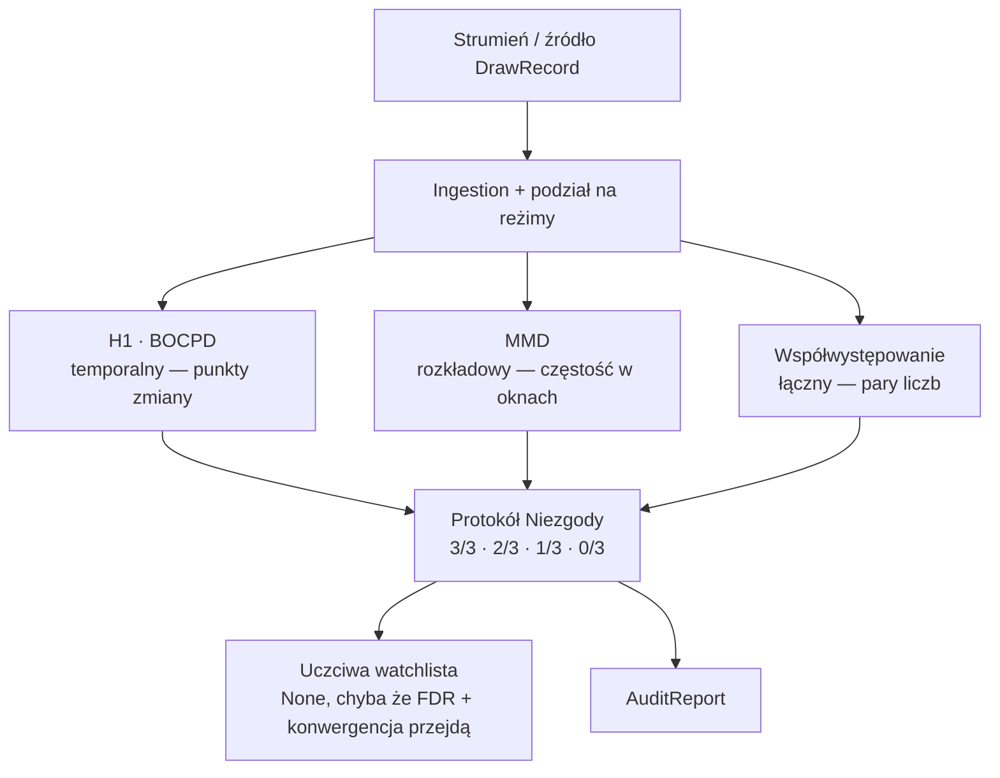
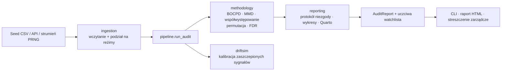

# DriftScope

[English](README.md) · **Polski**

[](https://github.com/Piotr1686/DriftScope/actions/workflows/ci.yml)
[](LICENSE)
[](pyproject.toml)


<p align="center">
  
  <br>
  <em>Instrument statystyczny, który wykrywa, kiedy strumień „losowych" danych po cichu przestaje być losowy — i milczy, kiedy tak się nie stało.</em>
</p>

<p align="center">
  📊 <strong><a href="https://piotr1686.github.io/DriftScope/">Raport na żywo</a></strong> ·
  📄 <strong><a href="https://piotr1686.github.io/DriftScope/executive_summary.html">Streszczenie zarządcze</a></strong> ·
  🧪 <strong>Demo interaktywne</strong> (<code>streamlit run demo/app.py</code>)
</p>

---

## Spis treści

- [Szybki start](#szybki-start)
- [Wersja na 30 sekund](#wersja-na-30-sekund)
- [Najważniejsze cechy](#najważniejsze-cechy)
- [Jak to działa](#jak-to-działa)
- [Dowód: EuroJackpot](#dowód-eurojackpot)
- [Czułość: benchmark PRNG](#czułość-benchmark-prng)
- [Reużywalność: Multi Multi](#reużywalność-multi-multi)
- [Dlaczego można mu ufać](#dlaczego-można-mu-ufać)
- [Architektura](#architektura)
- [Konfiguracja](#konfiguracja)
- [Użycie](#użycie)
- [Struktura projektu](#struktura-projektu)
- [Wymagania](#wymagania)
- [Wydajność](#wydajność)
- [Definicja ukończenia](#definicja-ukończenia)
- [Plan rozwoju](#plan-rozwoju)
- [Poza loterią](#poza-loterią)
- [Licencja](#licencja)
- [O autorze](#o-autorze)

---

## Szybki start

Wymaga **Pythona 3.10**.

```bash
# instalacja (edytowalna, z narzędziami dev)
pip install -e ".[dev]"
# Na Windows 11 / Miniconda, jeśli pip zgłosi błąd certyfikatu SSL, dodaj:
#   --trusted-host pypi.org --trusted-host files.pythonhosted.org

# uruchom pełny audyt na dołączonym seed CSV (958 losowań) i wypisz werdykt
driftscope run
```

To jedno polecenie wczytuje 958 prawdziwych losowań EuroJackpot, uruchamia audyt trzema
detektorami i wypisuje werdykt (kontrola pozytywna/negatywna + uczciwa watchlista). Wszystkie
opcje opisuje sekcja [Użycie](#użycie).

## Wersja na 30 sekund

Wyobraź sobie proces, który *powinien* być idealnie jednorodny — losowanie loterii, generator
liczb losowych w bibliotece kryptograficznej, czujnik, który ma odczytywać czysty szum, różnicę
między danymi treningowymi modelu a danymi, które widzi na produkcji. Jak *udowodnić*, że
zdryfował? I — trudniejsza połowa pytania — jak powstrzymać się przed „odkryciem" dryfu, którego
nigdy nie było? Wpatruj się w wystarczająco wiele liczb, a ludzki mózg zawsze znajdzie wzorzec.

To właśnie ten drugi tryb porażki jest kosztowny. Detektor, który wszczyna fałszywy alarm, jest
gorszy niż brak detektora. **DriftScope jest zbudowany wokół dyscypliny *niehalucynowania*
sygnału.** To metodologia, nie szklana kula: nigdy nie próbuje przewidzieć następnej liczby —
audytuje, czy rozkład wciąż zachowuje się poprawnie, i raportuje *brak* dowodu równie uczciwie jak
jego obecność.

> ⚠️ **To nie jest predyktor loterii.** Loteria jest wygodnym benchmarkiem ze znanym kluczem
> odpowiedzi — nic tutaj nie prognozuje losowania i nic tutaj nie mogłoby tego robić.

## Najważniejsze cechy

- 🎯 **Wbudowany klucz odpowiedzi.** Audyt na **958 prawdziwych losowaniach EuroJackpot
  (2012–2026)** — procesie, o którym *wiadomo*, że jego reguły zmieniły się dwukrotnie (pula
  euroliczb, w 2014 i 2022), podczas gdy główna pula 1–50 *nigdy* się nie zmieniła — naturalna
  **kontrola pozytywna *i* negatywna** w jednym zbiorze danych.
- ✅ **Znajduje realne zmiany i nie wymyśla żadnej na kontroli.** Wykrywa punkty zmiany pokrywające
  obie znane tranzycje (**2014-11-28**, **2022-03-29**); na niezmienionej puli 1–50 zwraca
  **0 znalezisk**, *uczciwy null* — nie pustą listę, lecz świadome „brak dowodu".
- 🔬 **Trzy komplementarne detektory, które muszą się zgadzać.** *Protokół Niezgody* nad trzema
  rodzinami o celowo różnych martwych polach — w szczególności sygnał łączny (par) łapie **tylko
  jeden** z nich, więc zgoda coś znaczy.
- 🧪 **Instrument jest skalibrowany i da się to udowodnić.** Skieruj tę samą baterię na PRNG-i ze
  znaną prawdą gruntową: milczy na poprawnych i kryptograficznych generatorach (kontrola negatywna
  samego benchmarku) i **flaguje dwa zaszczepione defekty** — a *wzorzec* tego, które detektory się
  zapalają, mówi, *jakiego rodzaju* jest defekt.
- 📐 **Prerejestrowany i odtwarzalny.** Każdy wybór statystyczny jest zamrożony *przed* spojrzeniem
  na wyniki (`preregistration_v7.md`); ponowny bieg w tym samym przypiętym środowisku jest
  **bit-identyczny** (manifest SHA-256 nad wynikami CSV).
- ⚡ **Szybki i lekki.** Pełny audyt biegnie w **~4,5 s** i sięga szczytowo **~210 MB RAM** na CPU
  laptopa. **278 testów**, CI zielone na Ubuntu / Python 3.10.

## Jak to działa

Pomyśl o trzech biegłych świadkach, z których każdy patrzy na ten sam strumień przez inne
szkło. Jeden obserwuje, *kiedy* rozkład przesuwa się w czasie. Jeden obserwuje, *czy* częstości
oddalają się od jednorodności. Jeden obserwuje, *które pary liczb* pojawiają się razem częściej,
niż pozwala przypadek. Żaden pojedynczy nie jest czuły na każdy rodzaj odchylenia — i o to właśnie
chodzi. Twierdzeniu ufa się tylko w stopniu, w jakim świadkowie się **zgadzają** (sygnał jest
oceniany 3/3 · 2/3 · 1/3 · 0/3).



| Filar | Rodzina | Co łapie | Na co jest ślepy |
|---|---|---|---|
| **H1** (BOCPD) | temporalny / globalny | punkty zmiany w rozkładzie symboli w czasie | strukturę par |
| **MMD** | rozkładowy | częstości w oknach oddalające się od jednorodności (przesunięcia, trendy) | strukturę par |
| **Współwystępowanie** | łączny | nadreprezentowane *pary* liczb przy jednorodnych marginesach (`pair_corr`) | sygnał marginalny |

Komplementarność jest konkretna, nie tylko deklarowana: czysty sygnał korelacji par, który
zachowuje każdy margines per-liczba, jest niewidoczny dla H1 i MMD — obu detektorów marginalnych,
które dzielą tu martwe pole — i łapie go **wyłącznie** współwystępowanie (ich moc spada do
poziomu częstości fałszywych alarmów; jest to niemal analityczne z konstrukcji i potwierdzone
empirycznie na zaszczepionych sygnałach). Każda klasa odchylenia ma co najmniej jeden detektor-
mistrza, więc zgoda coś znaczy.

> **Nota projektowa.** Filar H1 reprezentuje BOCPD (Bayesian Online Change-Point Detection,
> Adams–MacKay 2007), skalibrowany *per pole*. Klasyczne testy stacjonarności (ADF, KPSS, widmo
> Welcha, ACF) działają jako *diagnostyka* — **nie** głosują, co napompowałoby częstość fałszywych
> alarmów filaru przez skorelowane pod-testy.

## Dowód: EuroJackpot

Wynik nullowy („nic nie znaleźliśmy") jest coś wart tylko wtedy, gdy instrument potrafi znaleźć to,
co *naprawdę* tam jest. EuroJackpot to idealny poligon, bo niesie własny klucz odpowiedzi.

- **Kontrola pozytywna (euroliczby).** Pula euroliczb została rozszerzona zmianami reguł w 2014 i
  2022. BOCPD, uruchomiony na ślepo na pełnym strumieniu, wykrywa punkty zmiany pokrywające **obie**
  znane tranzycje — pierwsze losowanie zawierające „9" w dniu **2014-11-28** (posterior ≈ 0,41) i
  pierwsze „11" w dniu **2022-03-29** (≈ 0,40), oba powyżej progu i w top-5. *W pełnej szczerości:*
  jego pojedynczy **najwyższy** posteriorem punkt zmiany to faktycznie **2015-01-23** (≈ 0,47) — nie
  zmiana reguł, lecz fizyczny aftershock rozszerzenia z 2014, bo nowe euro-symbole pojawiały się po
  raz pierwszy jeszcze przez miesiące. Tak więc największy pik jest sam w sobie autentycznym
  przesunięciem rozkładu, nie artefaktem; detektor zapala się tam, gdzie istnieje realna zmiana, i
  nigdy nie wymyśla zmiany w kontroli negatywnej poniżej.
- **Kontrola negatywna (główna pula 1–50).** Tej puli nigdy nie ruszono. Oceniona *w obrębie
  każdego reżimu reguł* (R1 = 133, R2 = 389, R3 = 436 losowań) przez wszystkie trzy filary, werdykt
  to **R1 0/3 · R2 1/3 · R3 0/3**. Te nulle są stwierdzeniami *w granicach mocy testu*: R1, przy
  n = 133, to najcieńszy reżim, gdzie małe efekty per-reżim (np. przesunięcie per-liczba o ~1%) są
  poniżej wykrywalności — więc „0/3" jest tam czystą kontrolą, nie gwarancją dokładnej
  jednorodności. Samotna flaga jednofilarowa w R2 (jedna para liczb) jest **ani tłumiona, ani
  promowana** — zostaje sklasyfikowana jako *„jednofilarowa, wymaga kontekstu mocy"*, zgodnie z
  ~14% szansą, że jeden z trzech reżimów rzuci fałszywą flagę przy α = 0,05.
- **Bramka rygoru trzyma.** Korekta częstości fałszywych odkryć (FDR) per-liczba nad **150
  hipotezami** (50 liczb × 3 reżimy, Benjamini–Yekutieli) odrzuca **0/150**. Uczciwa watchlista
  zwraca **None**.

**Dlaczego nie stawiamy twardej bramki na ≥2/3.** Jak pokazano wyżej, autentyczny czysty sygnał par
jest widoczny **tylko** dla współwystępowania, więc wypływa jako **1/3, nie 3/3** — naiwna reguła
„≥2/3 = realne" byłaby strukturalnie ślepa na całą tę klasę defektów. Zamiast tego *główną* bramką
watchlisty jest **FDR** per-liczba (Rodzina B), z konwergencją wymaganą tylko na **≥1** filarze:
sygnał jednorodzinny, który *również* przechodzi FDR, może wypłynąć, podczas gdy samotna flaga bez
wsparcia FDR (para R2 powyżej) nie. Etykieta 1/3 kieruje („wymaga kontekstu mocy"); nie odrzuca.

Framework potwierdza znany sygnał i nie proponuje niczego tam, gdzie nie ma zbieżnego dowodu.
*Zastrzeżenie quasi-prawdy gruntowej: EuroJackpot to proces fizyczny, nie idealny RNG. To, co jest
naprawdę znane, to* zmiany reguł *(ex ante) i niezmienność puli 1–50 — i to one są kontrolami, a nie
założenie idealnej jednorodności.*

→ Pełny raport interaktywny (krzywe BOCPD, tabele per-reżim, 10-sekundowa animacja-haczyk):
**https://piotr1686.github.io/DriftScope/**

## Czułość: benchmark PRNG

Aby pokazać, że milczenie na EuroJackpot to *kalibracja*, a nie *ślepota*, **dokładnie ta sama
bateria** zostaje skierowana na generatory liczb losowych ze znaną prawdą gruntową — dwa poprawne
generatory, dwa kryptograficzne, ten sam generator z dwoma celowo wstrzykniętymi defektami różnego
rodzaju oraz prawdziwy EuroJackpot dla odniesienia (`python scripts/prng_benchmark.py`, n = 1500).
Tutaj Rodzina B biegnie na **pełnym strumieniu** (50 liczb) dla parytetu ze źródłami syntetycznymi —
strumienie PRNG nie mają reżimów kalendarzowych; nagłówek z podziałem na reżimy (0/150) powyżej jest
kanonicznym odczytem EuroJackpot:

| Źródło | Klasa | Rodzina B (odrzucenia/rozmiar) | MMD p | Współwyst. p | IT (LZ) p | Werdykt |
|---|---|---|---|---|---|---|
| MT19937 | dobry | 0/50 | 0,595 | 0,055 | 0,780 | **clear** |
| Xorshift64 | dobry | 0/50 | 0,700 | 0,320 | 0,315 | **clear** |
| ChaCha20 | krypto | 0/50 | 0,140 | 0,490 | 0,635 | **clear** |
| AES-CTR-DRBG | krypto | 0/50 | 0,740 | 0,225 | 0,710 | **clear** |
| MT19937 + bias | **defekt** (marginalny) | **1/50** | **0,005** | 0,465 | 0,970 | **FLAG** (wąski) |
| MT19937 + period-truncation | **defekt** (krótki cykl) | **27/50** | **0,005** | **0,005** | **0,005** | **FLAG** (szeroki) |
| EuroJackpot (główna 1–50) | realny | 0/50 | 0,885 | 0,940 | 0,700 | **clear** |

Oba defekty zapalają się **odmiennie i ten kontrast jest właśnie pokazem.** *Bias marginalny* (jedna
liczba nadreprezentowana) jest łapany wąsko — pęka jego binomial per-liczba (Rodzina B), a częstość
w oknach oddala się od jednorodności (MMD) — ale **nie** współwystępowanie, które celuje w pary, nie
w marginesy. *Period-truncation* (krótki cykl, który się powtarza, zamrażając cały rozkład) jest
łapany **szeroko, na wszystkich trzech filarach naraz**. Framework raportuje zatem nie tylko, *czy*
strumień jest wadliwy, ale *jakiego rodzaju* to defekt. Oba dobre PRNG-i, **oba** prymitywy krypto
(strumieniowy *i* blokowy) oraz prawdziwy EuroJackpot wracają **clear**.

**Uzupełniające szkło informacyjno-teoretyczne.** Poza trzema rdzeniowymi filarami test złożoności
**Lempel-Ziv 1976** (`reporting/information_theory.py`; null z przetasowaniem kolejności nad blokami
losowań, z krzyż-sprawdzeniem współczynnika kompresji `bz2`) dodaje widok *sekwencyjny*. Warunkuje
zarówno na marginesie, *jak i* na łącznym rozkładzie wewnątrz losowania, więc jest celowo ślepy na
bias marginalny (kolumna `IT (LZ) p` pozostaje wysoka dla `+bias`), lecz zapala się ostro na defekcie
**period-truncation** (zamrożony cykl jest kompresowalny). Prawdziwy EuroJackpot odczytuje jako
nieskompresowalny / clear (**p ≈ 0,70**). To **suplement, nie czwarty filar Protokołu Niezgody** —
ten zbiór pozostaje trójstronny.

> **Jak to się ma do NIST STS / Dieharder.** DriftScope jest *komplementarny* wobec dojrzałych
> pakietów testów losowości, nie zastępczy. Jego wyróżniające dodatki to **dedykowany detektor par
> współwystępujących**, walidacja na **rzeczywistym strumieniu ze znaną prawdą gruntową**, zakres
> **per-reżim**, **prerejestracja** każdego wyboru oraz jawna **abstynencja decyzyjna** (uczciwe
> „brak dowodu" zamiast wymuszonego werdyktu). Dla certyfikacji losowości na poziomie bitów sięgnij
> po NIST STS lub Dieharder; po *audyt dryfu na poziomie frameworku, walidowany prawdą gruntową* —
> sięgnij tutaj.

## Reużywalność: Multi Multi

Benchmark PRNG dowodzi czułości na strumieniach *syntetycznych*; twierdzenie o reużywalności zostaje
przypieczętowane na **drugiej prawdziwej grze**. *Multi Multi* losuje **20 liczb z puli 80** (wobec
5-z-50 w EuroJackpot). Ponieważ każdy detektor odczytuje swoją pulę i rozmiar losowania z samego
`DrawRecord`, ta sama bateria biegnie z **zerową zmianą kodu** — różni się tylko źródło danych
(`python scripts/multimulti_audit.py`, najnowsze 2000 z 16 827 losowań, 1996–2026). Po ponownej
kalibracji detektorów przy puli = 80 (częstość fałszywych alarmów MMD = **0,035** w 200 próbach
uczciwego nullu, `scripts/calibrate_mmd_pool.py`; próg BOCPD wyprowadzony ponownie na **0,34**) audyt
odczytuje **clear**: BOCPD, Rodzina B (**0/80**), współwystępowanie i suplement LZ wszystkie milczą.
Samotne odrzucenie MMD przy p ≈ 0,03 to dokładnie **jednofilarowy (1/3) fałszywy alarm, który
Protokół Niezgody ma absorbować** — oczekiwany ≈ 1 test na 20 i *nie* znalezisko bez konwergencji.
Strukturalnie inna prawdziwa gra (4× pula, 4× rozmiar losowania), ten sam skalibrowany instrument, to
samo zdyscyplinowane milczenie.

## Dlaczego można mu ufać

Wartością tego projektu jest jego uczciwość, więc twierdzenia o zaufaniu mapują się wprost na pliki i
na skalibrowane gwarancje — nie na przymiotniki.

- **„Halucynacja" ma precyzyjne znaczenie.** W całym projekcie *halucynacja* = **błąd I rodzaju
  (fałszywy alarm)**, skalibrowany permutacją Monte-Carlo wobec przetasowanego nullu do α ≈ 0,05.
  Częstość fałszywych alarmów każdego detektora jest zwalidowana ≈ α (**DoD-2**,
  `methodology/permutation.py`); próg odrzucenia BOCPD jest kalibrowany *per pole*.
- **Null to uczciwe „brak dowodu", nie „nic nie istnieje".** Watchlista zwraca **`None`** dopiero
  po tym, jak wzorzec nie przejdzie **obu** bramek — korekty FDR (q ≤ α) *oraz* konwergencji między
  filarami. `None` to świadoma **abstynencja decyzyjna** („niewystarczające podstawy"), odrębna od
  pustego wyniku i odrębna od ekstrapolacji (**DoD-5**, `adaptive/honest_watchlist.py`).
- **Krotność jest kontrolowana.** FDR świadomy rodzin — Benjamini–Hochberg / **Benjamini–Yekutieli**
  (ten drugi ważny przy *dowolnej* zależności, użyty, ponieważ zliczenia obecności 5/50 są ujemnie
  zależne — co czyni założenie PRDS dla BH niebezpiecznym) — nad realną rodziną hipotez (**DoD-3**,
  `methodology/multiple_testing.py`).
- **Wybory są zamrożone, zanim dane zostaną zobaczone.** Każda statystyka, null, próg i siatka
  effect-size żyją w `methodology/preregistration_v7.md`. Każda rewizja niesie `revision_reason`,
  jawnie rozdzielony na *czysty* vs *informowany danymi* — dyscyplina §0.
- **Odtwarzalność jest bit-dokładna.** Każdy detektor jest *czystą funkcją* strumienia; RNG jest
  seedowany z zawartości danych (⊕ `BASE_SEED`), niezależnie od kolejności wywołań.
  `scripts/archive.py` emituje deterministyczny manifest SHA-256, więc ponowny bieg na zimnej maszynie
  *w tym samym przypiętym środowisku* jest bit-identyczny (**DoD-6**).

Gdy dokumentacja mówi, że framework „nie halucynuje", czytaj to precyzyjnie: *w granicach mocy testu,
przy α = 0,05 i przy założeniach modelu.* To skalibrowany budżet błędu, nie gwarancja absolutna — i
powiedzenie tego wprost jest całym sensem.

## Architektura



**Uzasadnienie stacku.** CPU-only z założenia. **Polars** (nie pandas) dla type-safe, zwektoryzowanej
obróbki danych. **Numba** `@njit(cache=True)` na gorących pętlach permutacji / MMD / współwystępowania
— zmierzone **~2,7×** ponad bazę NumPy na PoC permutacji (`notebooks/poc_permutation_engine.py`), przy
czym kernele O(N²) zyskują więcej. **Pydantic v2** dla zwalidowanej konfiguracji, **Typer** dla CLI,
**Parquet + Zstd** dla artefaktów, **Quarto + Plotly + matplotlib** dla odtwarzalnego raportu.
Persystencja jest w pełni plikowa (brak warstwy bazy danych).

## Konfiguracja

Konfiguracja jest wczytywana przez **Pydantic Settings v2** z opcjonalnego pliku `.env`. Skopiuj
`.env.example` do `.env` i dostosuj wedle potrzeb — każdy klucz ma rozsądną wartość domyślną, więc
framework działa od ręki bez niego.

| Klucz | Domyślnie | Cel |
|---|---|---|
| `BASE_SEED` | `42` | Globalny seed determinizmu (każdy detektor wyprowadza z niego swój RNG ⊕ zawartość danych) |
| `DATA_SEED_PATH` | `./data/seed/eurojackpot_history.csv` | Dołączony seed CSV używany przez `driftscope run` |
| `ARTIFACTS_DIR` | `./artifacts` | Katalog wyjściowy figur i manifestu SHA-256 |
| `LOG_LEVEL` | `INFO` | Poziom szczegółowości logów |
| `SCRAPER_USER_AGENT` | `DriftScope/0.1 (research; …)` | User-Agent dla opcjonalnego scrapera |
| `SCRAPER_REQUEST_TIMEOUT_SEC` | `30` | Timeout żądania HTTP scrapera |
| `SCRAPER_RATE_LIMIT_DELAY_SEC` | `2` | Uprzejme opóźnienie między żądaniami scrapera |
| `LOTTO_API_KEY` | *(puste)* | Opcjonalny klucz API do oficjalnego źródła danych lotto (scraper to fallback) |

## Użycie

Punktem wejścia CLI jest `driftscope run`.

```bash
# pełny audyt na dołączonym seed CSV (958 losowań), wypisuje werdykt + zapisuje figury
driftscope run

# audyt własnego strumienia dyskretnego
driftscope run --seed-csv sciezka/do/draws.csv

# dostrój liczbę permutacji (domyślnie 999) dla nulli MMD / współwystępowania
driftscope run --n-perm 1999

# dodaj 10-sekundową animację-haczyk .webm (wymaga ffmpeg na PATH)
driftscope run --hook

# pomiń generowanie figur / przekieruj wyjście
driftscope run --no-figures
driftscope run --out-dir ./my_artifacts
```

| Opcja | Domyślnie | Opis |
|---|---|---|
| `--seed-csv` | config `DATA_SEED_PATH` | Ścieżka do wejściowego seed CSV |
| `--n-perm` | `999` | Liczba permutacji dla nulli MMD / współwystępowania |
| `--figures` / `--no-figures` | wł. | Generuj PNG-i porównania kontroli + BOCPD |
| `--hook` / `--no-hook` | wył. | Generuj animację-haczyk `.webm` (wolniejsze; wymaga ffmpeg) |
| `--out-dir` | config `ARTIFACTS_DIR` | Katalog wyjściowy figur |

**Odtworzenie pełnego raportu HTML** (wymaga CLI Quarto):

```bash
quarto render src/driftscope/reporting/report.qmd --to html
```

**Eksploracja interaktywna** — macierz detekcji, *szkło entropii* LZ76 oraz test Turinga
real-vs-uniform:

```bash
pip install -e ".[demo]"
streamlit run demo/app.py
```

**Skrypty reużywalności** — skieruj tę samą baterię na inne strumienie z prawdą gruntową:

```bash
python scripts/prng_benchmark.py      # macierz czułości/swoistości PRNG (n = 1500)
python scripts/multimulti_audit.py    # druga prawdziwa gra (Multi Multi, 20-z-80)
```

## Struktura projektu

```
src/driftscope/
├── ingestion/      # loader seed CSV + podział na reżimy + adaptery strumieni PRNG (rng_streams.py)
├── methodology/    # zamrożona nauka: BOCPD, MMD, współwystępowanie, permutacja,
│                   #   rekurencja, multiple-testing (BH / Benjamini-Yekutieli),
│                   #   krzywa specyfikacji, block bootstrap + preregistration_v*.md
├── driftsim/       # symulator zaszczepionych sygnałów (5 sygnałów × 4 effect sizes) + kalibracja
├── reporting/      # protokół niezgody, wykresy statyczne + interaktywne, benchmark PRNG,
│                   #   suplement informacyjno-teoretyczny (LZ76), raport Quarto
├── adaptive/       # uczciwa watchlista (zwraca None, chyba że DoD-3 ORAZ DoD-4 przejdą)
├── pipeline.py     # orkiestrator end-to-end: run_audit(draws) -> AuditReport
└── cli.py          # `driftscope run`
scripts/            # archive (manifest SHA-256), prng_benchmark + multimulti_audit (reużywalność)
demo/               # eksplorator audytu Streamlit (opcjonalny, `pip install -e ".[demo]"`)
tests/              # 278 testów — kalibracja, niezmienniki, FPR ≤ α, odtwarzalność, PRNG, info-theory
data/seed/          # eurojackpot_history.csv (958 losowań) + multimulti_history.csv (w repo)
docs/               # opublikowany raport HTML + streszczenie zarządcze (GitHub Pages)
```

## Wymagania

- **Python 3.10** (`>=3.10,<3.11`) — przypięty pod zweryfikowany toolchain Numby.
- **Rdzeń obliczeniowy:** `numpy>=2.2`, `numba==0.65.1` (pinned — zweryfikowany Win11 + numpy 2.x), `joblib`.
- **Statystyka:** `statsmodels`, `scipy`, `scikit-learn`, `ruptures`.
- **Dane / config:** `polars` (nie pandas), `pyarrow` (Parquet + Zstd), `pydantic` v2, `pydantic-settings`.
- **CLI / wizualizacja:** `typer` + `click`, `matplotlib`, `plotly`.
- **Scraper / krypto:** `httpx`, `selectolax`, `tenacity`, `cryptography` (keystream ChaCha20 / AES-CTR).
- **Dodatki dev** (`.[dev]`): `pytest`, `hypothesis`, `ruff`, `mypy`.
- **Dodatek demo** (`.[demo]`): `streamlit`.

Pełny przypięty zestaw żyje w [`pyproject.toml`](pyproject.toml). CPU-only — GPU nie jest wymagane.

## Wydajność

| Metryka | Wartość | Warunki |
|---|---|---|
| Pełny audyt | **~4,5 s**, **~210 MB** szczytowo RAM | 958 losowań, `n_perm=999`, i5-12500H (CPU-only) |
| Pakiet testów | **278 zebranych**, CI zielone | 276 pass / 2 skip lokalnie (Win11); jeden test tylko-Windows dodatkowo pomijany na Ubuntu CI |
| Gorące pętle JIT | **~2,7×** vs baza NumPy | PoC permutacji (`notebooks/poc_permutation_engine.py`) |

> Liczba ~4 GB RAM czasem przypisywana DriftScope to **budżet pełnego przebiegu kalibracji DriftSim**
> (63 syntetyczne zbiory × wszystkie testy × 10⁴ permutacji), *nie* nagłówkowy audyt — który, jak
> zmierzono powyżej, to kilka sekund i kilkaset MB.

## Definicja ukończenia

| DoD | Walidowane przez | Kryterium |
|---|---|---|
| DoD-1 | BOCPD na euron vs main | wykrywa zmiany puli 2014/2022; czysto na kontroli negatywnej 1–50 |
| DoD-2 | `methodology/permutation.py` | FPR ≤ α = 0,05 ± błąd MC przy przetasowanym nullu |
| DoD-3 | `methodology/multiple_testing.py` | FDR świadomy rodzin (BH / Benjamini-Yekutieli) |
| DoD-4 | `reporting/disagreement.py` | każdy sygnał sklasyfikowany 3/3 · 2/3 · 1/3 · 0/3 |
| DoD-5 | `adaptive/honest_watchlist.py` | zwraca `None`, gdy DoD-3/4 zawiodą |
| DoD-6 | `core/seeds.py` + manifest | ponowny bieg na zimnej maszynie jest bit-identyczny |

## Plan rozwoju

Wszystkie poniższe pozycje są **planowane / eksploracyjne** — żadna nie jest wdrożona:

- **strumieniowy** detektor MMD nad danymi ciągłymi (odrębny od wdrożonego MMD na częstości w oknach)
  — pomost do danych sensorowych / finansowych;
- tryb online z czynnikiem zapominania (okienkowy BOCPD) — pomost do strumieni na żywo;
- adapter strumieniowy (Kafka / Redpanda) — jawnie *planowany*; pipeline jest dziś wsadowy;
- pakiet PyPI z jednowywołaniowym API `audit_stream(...)`;
- mała usługa FastAPI zwracająca werdykt JSON (`{verdict, regime, timestamp}`);
- nota arXiv z pełną analizą mocy i porównaniem do NIST STS.

## Poza loterią

Silnik jest ogólnym detektorem zmiany rozkładu w strumieniach dyskretnych, więc loteria jest tylko
pierwszym źródłem `DrawRecord`. Poniższe to **wizje zastosowań**, nie wdrożone integracje:

1. **Pharma / Analytical Development** *(najbliżej domeny autora)* — monitoring stabilności procesu
   (granulacja, tabletkowanie), dryf CPP/CQA, dane PAT: złap przesunięcie rozkładu w
   twardości / czasie rozpadu / wilgotności *zanim* parametr przekroczy specyfikację, z uczciwym
   nullem tłumiącym fałszywe alarmy OOT.
2. **MLOps — dryf danych i konceptu** — audytuj różnicę między rozkładem treningowym a produkcyjnym z
   właściwą kontrolą FDR zamiast progów ad-hoc.
3. **FinTech / trading** — detekcja zmiany reżimu, audyt „błądzenia losowego" i sygnatury manipulacji
   (spoofing, wash trading) wydobywane przez filar współwystępowania.

Ten sam wzorzec rozszerza się na cyberbezpieczeństwo (dryf logów / ruchu, beaconing C2), predykcyjne
utrzymanie ruchu IoT (dryf czujnika przed awarią) i regulowane gry (RNG automatów / audyt drop-rate
loot-boxów).

## Licencja

[MIT](LICENSE).

## O autorze

Zbudowany samodzielnie przez **Piotra Łazowskiego** — interdyscyplinarnego inżyniera R&D / badań
statystycznych pracującego na styku **farmaceutycznego rozwoju analitycznego** i **AI/ML**.
DriftScope to projekt portfolio demonstrujący end-to-end inżynierię oprogramowania statystycznego:
projektowanie metodologii, kalibrację, odtwarzalność i dostarczenie. · GitHub:
[@Piotr1686](https://github.com/Piotr1686)
