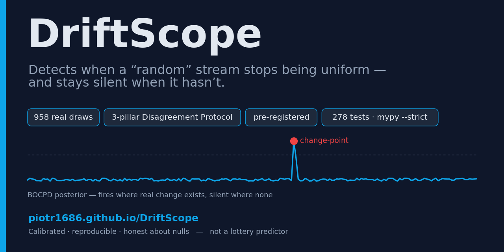
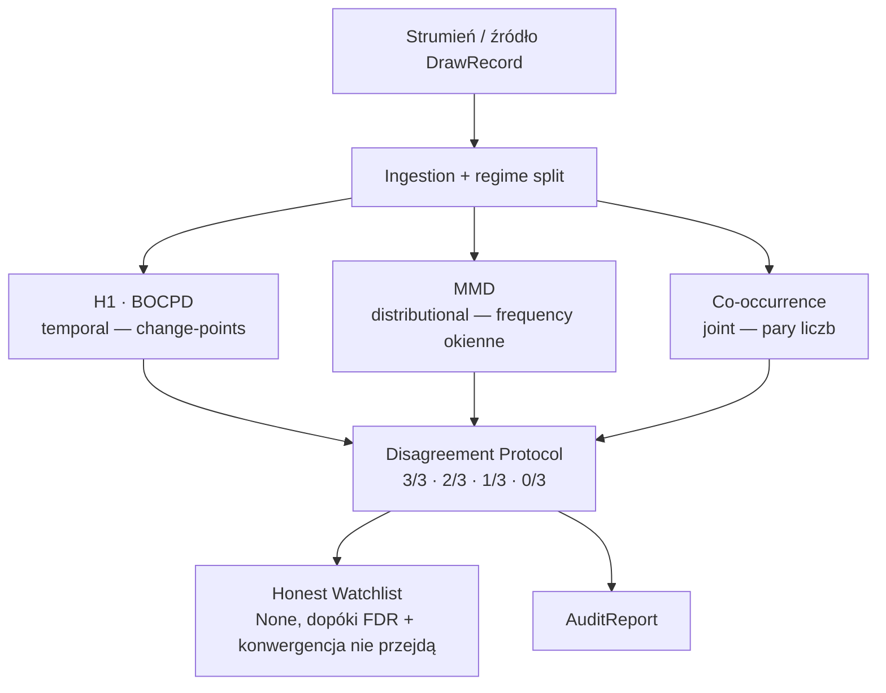
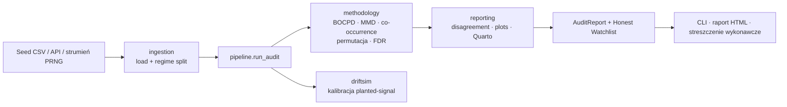

# DriftScope

[English](README_REVISED.md) · **Polski**

[](https://github.com/Piotr1686/DriftScope/actions/workflows/ci.yml)
[](../../LICENSE)
[](../../pyproject.toml)


<p align="center">
  
  <br>
  <em>Instrument statystyczny, który wykrywa, kiedy strumień „losowych" danych po cichu przestaje być losowy — i celowo milczy, gdy nadal jest.</em>
</p>

<p align="center">
  📊 <strong><a href="https://piotr1686.github.io/DriftScope/">Raport na żywo</a></strong> ·
  📄 <strong><a href="https://piotr1686.github.io/DriftScope/executive_summary.html">Streszczenie wykonawcze</a></strong> ·
  🧪 <strong>Demo interaktywne</strong> (<code>streamlit run demo/app.py</code>)
</p>

> **Dla kogo.** Jeśli masz proces, który *powinien* pozostać uniform — RNG, cechę ML
> (trening/produkcja), czujnik, strumień kontroli procesu — DriftScope audytuje, czy zadryfował,
> ze skalibrowaną kontrolą fałszywych alarmów i uczciwym „brak dowodu", gdy nie zadryfował.
> Loteria poniżej to tylko benchmark ze znanym kluczem odpowiedzi. Zob. [Poza loterią](#poza-loterią).

---

## Spis treści

- [Szybki start](#szybki-start)
- [Co zobaczysz](#co-zobaczysz)
- [Wersja 30-sekundowa](#wersja-30-sekundowa)
- [Mini-słowniczek](#mini-słowniczek)
- [Najważniejsze](#najważniejsze)
- [Jak to działa](#jak-to-działa)
- [Dowód: EuroJackpot](#dowód-eurojackpot)
- [Czułość: benchmark PRNG](#czułość-benchmark-prng)
- [Reużywalność: Multi Multi](#reużywalność-multi-multi)
- [Dlaczego można zaufać](#dlaczego-można-zaufać)
- [Poza loterią](#poza-loterią)
- [Architektura](#architektura)
- [Konfiguracja](#konfiguracja)
- [Użycie](#użycie)
- [Wymagania](#wymagania)
- [Wydajność](#wydajność)
- [Definition of Done](#definition-of-done)
- [Roadmap](#roadmap-1)
- [Licencja](#licencja)
- [O autorze](#o-autorze)

---

## Szybki start

Wymaga **Python 3.10**.

```bash
# instalacja (editable, z narzędziami dev)
pip install -e ".[dev]"
# Windows 11 / Miniconda — przy błędzie certyfikatu SSL dodaj:
#   --trusted-host pypi.org --trusted-host files.pythonhosted.org

# uruchom pełny audyt na dołączonym seed CSV (958 losowań) i wydrukuj werdykt
driftscope run
```

Ta jedna komenda wczytuje 958 realnych losowań EuroJackpot, uruchamia audyt trzech detektorów
i drukuje werdykt (positive/negative control + honest watchlist).

## Co zobaczysz

`driftscope run` drukuje blok werdyktu. Na dołączonych danych EuroJackpot (positive control =
euronumery ze znanymi zmianami reguł 2014/2022; negative control = niezmieniona pula 1–50):

```text
Wczytano 958 losowań z data/seed/eurojackpot_history.csv

DriftScope audit — werdykt na strumieniu:
  POSITIVE CONTROL (euron/BOCPD, full-stream): reject=True;
    top change-points: 2015-01-23 (p=0.47), 2014-11-28 (p=0.41), 2022-03-29 (p=0.40)
  NEGATIVE CONTROL (main 1–50, 3 filary, per reżim):
    R1 (n=133): 0/3 (brak sygnału)
    R2 (n=389): 1/3 (single-pillar, wymaga kontekstu mocy)
    R3 (n=436): 0/3 (brak sygnału)
  Family B (per-number FDR, Benjamini-Yekutieli): 0/150 odrzuceń
  WATCHLIST (DoD-5): None (honest null)
```

Czytaj to jako: *detektor zapala się tam, gdzie istnieje realna zmiana (pula euron), nie wymyśla
niczego na kontroli i abstynuje (`None`) zamiast wymuszać werdykt.* Zob. [Użycie](#użycie).

## Wersja 30-sekundowa

Wyobraź proces, który *powinien* być idealnie uniform — losowanie loterii, generator liczb
losowych w bibliotece kryptograficznej, czujnik mający czytać czysty szum, różnica między danymi
treningowymi modelu a tymi z produkcji. Jak *udowodnić*, że zadryfował? I — trudniejsza połowa —
jak powstrzymać się przed „odkryciem" dryfu, którego nigdy nie było? Wpatrz się w dość liczb,
a ludzki mózg zawsze znajdzie wzór.

Ten drugi tryb porażki jest kosztowny. Detektor, który krzyczy „wilk", jest gorszy niż jego brak.
**DriftScope jest zbudowany wokół dyscypliny *niehalucynowania* sygnału — gdzie „nie halucynuje"
znaczy precyzyjnie: skalibrowany odsetek fałszywych alarmów α = 0.05, w granicach mocy testu
i przy założeniach modelu** (nie absolutna gwarancja — i to jest cały sens). To metodologia, nie
szklana kula: nigdy nie przewiduje następnej liczby — audytuje, czy rozkład wciąż się zachowuje,
i raportuje *brak* dowodu równie uczciwie jak jego obecność.

> ⚠️ **To NIE jest predyktor loterii.** Loteria to wygodny benchmark ze znanym kluczem odpowiedzi
> — nic tu nie prognozuje losowania i nic nie mogłoby.

## Mini-słowniczek

*Jednozdaniowe glosy żargonu używanego niżej — pomiń, jeśli już nim mówisz.*

- **null / hipoteza zerowa** — baza „nic nie jest nie tak" (tu: stacjonarny, uniform, i.i.d.
  strumień). Próbujemy ją *odrzucić*; brak odrzucenia = „brak dowodu dryfu".
- **błąd I rodzaju / fałszywy alarm / „halucynacja"** — zgłoszenie dryfu, którego nie ma.
- **test permutacyjny** — szacowanie zaskoczenia danymi przez wielokrotne ich tasowanie;
  najmniejsza raportowalna wartość p to *floor* = 1/(permutacje + 1).
- **change-point (BOCPD)** — moment w czasie, gdzie rozkład się zmienia; BOCPD = *Bayesian Online
  Change-Point Detection* (Adams–MacKay 2007).
- **MMD** — *Maximum Mean Discrepancy*: odległość między dwoma rozkładami; tu obserwowane częstości
  okienne vs świeży uniform.
- **co-occurrence** — jak często dwie konkretne liczby pojawiają się *razem*, ponad przypadek.
- **FDR (BH / Benjamini-Yekutieli)** — kontrola odsetka fałszywych odkryć przy wielu hipotezach naraz.
- **reżim** — okres pod jednym ustalonym zestawem reguł (EuroJackpot ma trzy: R1/R2/R3).
- **3/3 · 2/3 · 1/3 · 0/3** — ilu z trzech niezależnych detektorów zgadza się co do sygnału.

## Najważniejsze

- 🎯 **Wbudowany klucz odpowiedzi.** Audyt na **958 realnych losowaniach EuroJackpot (2012–2026)**,
  procesie, którego reguły *wiadomo*, że zmieniły się dwukrotnie (pula euronumerów, 2014 i 2022),
  podczas gdy pula główna 1–50 *nigdy* się nie zmieniła — naturalny **positive *i* negative
  control** w jednym zbiorze.
- ✅ **Znajduje realne zmiany i nie wymyśla żadnej na kontroli.** Wykrywa change-pointy pokrywające
  oba znane przejścia (**2014-11-28**, **2022-03-29**); na niezmienionej puli 1–50 zwraca
  **0 znalezisk**, *honest null* — nie pustą listę, lecz świadome „brak dowodu".
- 🔬 **Trzy komplementarne detektory, ważone zgodnością.** *Disagreement Protocol* nad trzema
  rodzinami o celowo różnych ślepych plamkach. Nie muszą *wszystkie* się zgadzać: pojedynczy
  championski detektor, który *dodatkowo* przechodzi FDR, też może ujawnić realny sygnał — w
  szczególności sygnał łączny (par) łapie **tylko jedna** rodzina, więc zgodność jest informatywna,
  a nie bramką.
- 🧪 **Instrument jest skalibrowany i można to udowodnić.** Skieruj ten sam battery na PRNG ze
  znanym ground-truth: milczy na poprawnych i kryptograficznych generatorach (negative control dla
  samego benchmarku) i **zapala się na dwóch wstrzykniętych defektach** — a *wzorzec* tego, które
  detektory się zapaliły, mówi o *rodzaju* defektu.
- 📐 **Pre-rejestracja i reprodukowalność.** Każdy wybór statystyczny zamrożony *przed* spojrzeniem
  na wyniki (`preregistration_v7.md`); re-run **w tym samym pinned environment** jest bit-identyczny
  (deterministyczny RNG seedowany z zawartości + manifest SHA-256).
- ⚡ **Szybko i lekko.** Pełny audyt biegnie w **~4.5 s** i szczytuje na **~220 MB RAM** na CPU
  laptopa (i5-12500H). **278 testów** (276 pass / 2 skip), CI-green na Ubuntu / Python 3.10.

## Jak to działa

Pomyśl o trzech biegłych świadkach, każdy patrzy na ten sam strumień przez inną soczewkę. Jeden
patrzy *kiedy* rozkład się przesuwa w czasie. Jeden — *czy* częstości odchylają się od uniform.
Jeden — *które pary liczb* pojawiają się razem częściej niż pozwala przypadek. Żaden nie jest
czuły na każdy rodzaj odchylenia — i o to chodzi. Twierdzenie jest oceniane wg liczby zgodnych
świadków (3/3 · 2/3 · 1/3 · 0/3) i promowane dopiero, gdy *dodatkowo* przejdzie bramkę FDR.



| Filar | Rodzina | Co łapie | Na co ślepy |
|---|---|---|---|
| **H1** (BOCPD) | temporalna / globalna | change-pointy rozkładu symboli w czasie | struktura par |
| **MMD** | rozkładowa | częstości okienne odchylające się od uniform (shift, trend) | struktura par |
| **Co-occurrence** | łączna | nadreprezentowane *pary* liczb przy uniform marginesach (`pair_corr`) | sygnał marginalny |

Komplementarność jest konkretna, nie tylko deklarowana, i **potwierdzona empirycznie na planted
signals** (`tests/test_driftsim_calibration.py::test_chi2_blind_to_pair_correlation`,
`tests/test_permutation_null.py::test_serial_blind_to_pair_corr`,
`tests/test_cooccurrence.py::test_detects_planted_pair_corr_showcase`): czysto-parowy sygnał, który
zachowuje każdy margines per-liczba, jest niewidzialny dla detektorów marginalnych (H1, MMD) — ich
moc spada do odsetka fałszywych alarmów — i łapie go **wyłącznie** co-occurrence. Każda klasa
odchylenia ma co najmniej jednego championa, więc zgodność jest znacząca.

> **Nota projektowa.** Filar H1 reprezentuje BOCPD, kalibrowany *per pole* (progi reject euron 0.33
> / main 0.70, FPR ≈ 0.05). Klasyczne testy stacjonarności (ADF, KPSS, widmo Welcha, ACF) działają
> jako *diagnostyka* — **nie** głosują, co zawyżyłoby FPR filaru przez skorelowane pod-testy.

## Dowód: EuroJackpot

Wynik nullowy („nic nie znaleźliśmy") jest coś wart tylko, jeśli instrument potrafi znaleźć to, co
*jest*. EuroJackpot to idealny poligon, bo niesie własny klucz odpowiedzi.

- **Positive control (euronumery).** Pula euronumerów została poszerzona zmianami reguł w 2014 i
  2022. BOCPD, uruchomiony na ślepo na pełnym strumieniu, wykrywa change-pointy pokrywające **oba**
  znane przejścia — pierwsze losowanie z „9" w dniu **2014-11-28** (posterior ≈ 0.41) i pierwsze
  „11" w dniu **2022-03-29** (≈ 0.40), oba powyżej progu euron (0.33) i w top-5. *W pełnej
  uczciwości:* jego **najwyższy** posterior change-point to faktycznie **2015-01-23** (≈ 0.47) — nie
  zmiana reguł, lecz fizyczny aftershock ekspansji 2014, gdy nowe symbole euron wciąż po raz
  pierwszy pojawiały się miesiącami później. Więc największy pik to sam w sobie realna zmiana
  rozkładu, nie spurious; detektor zapala się tam, gdzie istnieje realna zmiana, i nigdy nie wymyśla
  jej na negative control poniżej.
- **Negative control (pula główna 1–50).** Ta pula nigdy nie była ruszana. Oceniana *w każdym
  reżimie reguł* (R1 = 133, R2 = 389, R3 = 436 losowań) przez wszystkie trzy filary, werdykt to
  **R1 0/3 · R2 1/3 · R3 0/3**. Te nulle to stwierdzenia *w granicach mocy testu*: R1, przy n = 133,
  jest najcieńszym reżimem, gdzie małe efekty per-reżim (np. shift per-liczba ~1%) są poniżej
  detekcji — więc „0/3" tam to czysta kontrola, nie gwarancja idealnego uniform. Samotna flaga
  single-pillar w R2 (jedna para liczb) jest **nie tłumiona i nie promowana** — klasyfikowana jako
  *„single-pillar, wymaga kontekstu mocy"*, spójnie z ~14% szansą, że jeden z trzech reżimów rzuci
  spurious flagę przy α = 0.05.
- **Bramka rygoru trzyma.** Korekcja FDR per-liczba nad **150 hipotezami** (50 liczb × 3 reżimy,
  Benjamini–Yekutieli) odrzuca **0/150**. Honest watchlist zwraca **None**. *(Testy omnibus — chi²,
  gap, co-occurrence — raportowane są jako osobne rodziny komplementarne, NIE wliczane do tego
  licznika per-liczba; zob. `preregistration_v7.md` §5.)*

**Dlaczego nie bramkujemy twardo na ≥2/3.** Prawdziwy czysto-parowy sygnał jest widoczny **tylko**
dla co-occurrence, więc ujawnia się jako **1/3, nie 3/3** — naiwna reguła „≥2/3 = realne" byłaby
strukturalnie ślepa na całą tę klasę defektów. Zamiast tego *podstawowa* bramka watchlisty to FDR
per-liczba (Family B), z konwergencją wymaganą tylko przy **≥1** filarze: sygnał jednorodzinny,
który *dodatkowo* przechodzi FDR, może się ujawnić, a samotna flaga bez wsparcia FDR (para R2
powyżej) — nie. Etykieta 1/3 routuje („wymaga kontekstu mocy"); nie oddala.

*Caveat quasi-ground-truth: EuroJackpot to proces fizyczny, nie idealny RNG. To, co naprawdę
wiadomo, to* zmiany reguł *(ex ante) i niezmienność puli 1–50 — i to są kontrole, nie założenie
idealnego uniform.*

→ Pełny raport interaktywny (krzywe BOCPD, tabele per-reżim, 10-sekundowy animowany hook):
**https://piotr1686.github.io/DriftScope/**

## Czułość: benchmark PRNG

By pokazać, że cisza na EuroJackpot to *kalibracja*, a nie *ślepota*, **dokładnie ten sam battery**
kierowany jest na generatory liczb losowych ze znanym ground-truth — dwa poprawne generatory, dwa
kryptograficzne, ten sam generator z dwoma celowo wstrzykniętymi defektami różnego rodzaju oraz
realny EuroJackpot dla odniesienia.

Uruchom samodzielnie:

```bash
python scripts/prng_benchmark.py          # defaults: n_draws=1500, n_perm=499
```

Family B biegnie tu **full-stream** (50 liczb) dla parytetu ze źródłami syntetycznymi — strumienie
PRNG nie mają reżimów kalendarzowych; headline regime-split (0/150) powyżej to kanoniczny odczyt
EuroJackpot. Wartości p poniżej to **estymaty permutacyjne Monte-Carlo** przy `n_perm=499`, więc
najmniejsza raportowalna wartość to **floor** `1/(n_perm+1) ≈ 0.002` (pokazany jako `≤ 0.002`);
wartości non-floor to estymaty z jednego runu i będą się wahać między uruchomieniami — czytaj
**kolumnę werdyktu**, nie trzecią cyfrę po przecinku.

| Źródło | Klasa | Family B (reject/size) | MMD p | Co-occ p | IT (LZ) p | Werdykt |
|---|---|---|---|---|---|---|
| MT19937 | good | 0/50 | 0.596 | 0.124 | 0.758 | **clear** |
| Xorshift64 | good | 0/50 | 0.710 | 0.430 | 0.302 | **clear** |
| ChaCha20 | crypto | 0/50 | 0.160 | 0.664 | 0.626 | **clear** |
| AES-CTR-DRBG | crypto | 0/50 | 0.740 | 0.264 | 0.720 | **clear** |
| MT19937 + bias | **defekt** (marginalny) | **1/50** | **≤ 0.002** | 0.430 | 0.948 | **FLAG** (wąsko) |
| MT19937 + period-truncation | **defekt** (krótki cykl) | **27/50** | **≤ 0.002** | **≤ 0.002** | **≤ 0.002** | **FLAG** (szeroko) |
| EuroJackpot (main 1–50) | real | 0/50 | 0.864 | 0.952 | 0.698 | **clear** |

Dwa defekty zapalają się **różnie i ten kontrast jest pokazem.** *Bias marginalny* (jedna liczba
nadreprezentowana) jest łapany wąsko — pęka jego binomial per-liczba (Family B) i jego częstość
okienna odchyla się od uniform (MMD) — ale **nie** co-occurrence, które celuje w pary.
*Period-truncation* (krótki cykl, który się powtarza, zamrażając cały rozkład) jest łapany **szeroko
przez wszystkie trzy filary naraz**. Framework raportuje więc nie tylko *czy* strumień jest wadliwy,
ale *jakiego rodzaju* jest defekt. Oba dobre PRNG, **oba** prymitywy krypto (szyfr strumieniowy *i*
blokowy) oraz realny EuroJackpot wracają **clear**.

> **„Clear" znaczy brak wykrytego defektu w granicach mocy tego testu** (n = 1500, 50 symboli) — nie
> certyfikat jakości kryptograficznej. Do certyfikacji losowości na poziomie bitów sięgnij po NIST
> STS lub Dieharder; DriftScope jest wobec tych pakietów *komplementarny*.

**Suplementarna soczewka informacyjno-teoretyczna.** Poza trzema rdzeniowymi filarami, test
złożoności **Lempel-Ziv 1976** (`reporting/information_theory.py`; null przez order-shuffle bloków
losowań, z cross-checkiem ratio kompresji `bz2`) dodaje widok *sekwencyjny*. Warunkuje na marginesie
*oraz* na łącznym wewnątrz-losowania, więc jest celowo ślepy na bias marginalny (kolumna `IT (LZ) p`
zostaje wysoka dla `+bias`), lecz zapala się ostro na defekcie **period-truncation** (zamrożony cykl
jest kompresowalny). Czyta realny EuroJackpot jako nieskompresowalny / clear (**p ≈ 0.70**). To
**suplement, nie czwarty filar Disagreement Protocol** — ten zestaw pozostaje trójdzielny.

> **Jak to się ma do NIST STS / Dieharder.** Wyróżniki DriftScope to **dedykowany detektor par
> współwystępujących**, walidacja wobec **realnego strumienia ze znanym ground-truth**, scoping
> **per-reżim**, **pre-rejestracja** każdego wyboru oraz jawna **abstynencja decyzyjna** (uczciwe
> „brak dowodu" zamiast wymuszonego werdyktu).

## Reużywalność: Multi Multi

Benchmark PRNG dowodzi czułości na strumieniach *syntetycznych*; claim reużywalności domyka się na
**drugiej realnej grze**. *Multi Multi* losuje **20 liczb z puli 80** (vs 5-z-50 EuroJackpot).
Ponieważ każdy detektor czyta swoją pulę i rozmiar losowania z samego `DrawRecord`, ten sam battery
biegnie z **zerową zmianą kodu** — różni się tylko źródło danych (`python scripts/multimulti_audit.py`,
najnowsze 2 000 z 16 827 losowań, 1996–2026). Po re-kalibracji detektorów przy pool = 80 (FPR MMD ≈
**0.035** nad 200 honest-null trials — w granicach błędu Monte-Carlo od α = 0.05;
`scripts/calibrate_mmd_pool.py`; próg BOCPD przeliczony do **0.34**), audyt czyta **clear**: BOCPD,
Family B (**0/80**), co-occurrence i suplement LZ — wszystkie milczą. Samotne odrzucenie MMD przy
p ≈ 0.03 to dokładnie ten **single-pillar (1/3) fałszywy alarm, który Disagreement Protocol ma
absorbować** — oczekiwany ≈ 1 test na 20 i *nie* finding bez konwergencji. Strukturalnie inna realna
gra (4× pula, 4× rozmiar losowania), ten sam skalibrowany instrument, ta sama zdyscyplinowana cisza.

## Dlaczego można zaufać

Wartością tego projektu jest jego uczciwość, więc claimy zaufania mapują się wprost na pliki i na
skalibrowane gwarancje — nie przymiotniki.

- **„Halucynacja" ma precyzyjne znaczenie.** Wszędzie *halucynacja* = **błąd I rodzaju (fałszywy
  alarm)**, skalibrowany permutacją Monte-Carlo wobec tasowanego nulla do α ≈ 0.05. FPR każdego
  detektora jest walidowany ≈ α (**DoD-2**, `methodology/permutation.py`); próg reject BOCPD jest
  kalibrowany *per pole*.
- **Null to uczciwe „brak dowodu", nie „nic nie istnieje".** Watchlist zwraca **`None`** dopiero,
  gdy wzorzec nie przejdzie bramki — korekcji FDR (q ≤ α) *oraz* konwergencji przy ≥ 1 filarze.
  `None` to świadoma **abstynencja decyzyjna** („niewystarczające podstawy"), różna od pustego
  wyniku i od ekstrapolacji (**DoD-5**, `adaptive/honest_watchlist.py`).
- **Wielokrotność jest kontrolowana.** Family-aware FDR — Benjamini–Hochberg (Family A) /
  **Benjamini–Yekutieli** (Family B; ten drugi ważny przy *dowolnej* zależności, użyty bo zliczenia
  obecności 5/50 są ujemnie zależne — co czyni założenie PRDS dla BH niepewnym) — nad realną rodziną
  hipotez (**DoD-3**, `methodology/multiple_testing.py`).
- **Wybory zamrożone przed zobaczeniem danych.** Każda statystyka, null, próg i siatka effect-size
  żyje w `methodology/preregistration_v7.md`. Każda rewizja niesie `revision_reason`, jawnie
  rozdzielony na *clean* vs *data-informed* — dyscyplina §0.
- **Reprodukowalność bit-dokładna w tym samym pinned environment.** Każdy detektor jest *czystą
  funkcją* strumienia; jego RNG seedowany jest z zawartości danych (digest BLAKE2b ⊕ stały base
  seed), niezależnie od kolejności wywołań (`tests/test_reproducibility.py`). `scripts/archive.py`
  emituje deterministyczny manifest SHA-256 nad committed wejściowymi CSV (**DoD-6**). Bit-identyczność
  cross-machine jest *argumentowana* z tego determinizmu, nie certyfikowana osobno przez różne
  builds OS / BLAS — gwarancja jest scoped do pinned toolchain.

## Poza loterią

Silnik to ogólny detektor zmiany rozkładu w dyskretnych strumieniach, więc loteria to tylko pierwsze
źródło `DrawRecord`. Poniższe to **wizje zastosowań**, nie wdrożone integracje:

1. **Pharma / Analytical Development** *(najbliżej domeny autora)* — monitoring stabilności procesu
   (granulacja, tabletkowanie), dryf CPP/CQA, dane PAT: złap przesunięcie rozkładu twardości /
   rozpadu / wilgotności *zanim* parametr przekroczy spec, z honest null tłumiącym fałszywe alarmy OOT.
2. **MLOps — data & concept drift** — audyt różnicy między rozkładem treningowym a produkcyjnym z
   właściwą kontrolą FDR zamiast ad-hoc progów.
3. **FinTech / trading** — detekcja zmiany reżimu, audyt „random walk" i sygnatury manipulacji
   (spoofing, wash trading) ujawniane przez filar co-occurrence.

Ten sam wzorzec rozciąga się na cyberbezpieczeństwo (dryf logów / ruchu, C2 beaconing), predykcyjny
maintenance IoT (dryf czujnika przed awarią) i regulowany gaming (RNG slotów / audyt drop-rate
loot-boxów).

**Integracja w praktyce.** Zbuduj `list[DrawRecord]` przez `DrawRecord.generic(date, numbers,
pool_size)`, potem wywołaj `pipeline.run_audit(draws) -> AuditReport`; werdykt żyje w
`report.watchlist is None` (clear), `report.family_b.n_reject` oraz per-reżim
`report.regime_audits[R].verdict.fraction`. Wrapper `audit_stream(...)` jednym wywołaniem i werdykt
JSON są na [Roadmap](#roadmap-1).

## Architektura



**Uzasadnienie stacku.** CPU-only z założenia. **Polars** (nie pandas) dla type-safe, wektorowej
obróbki danych. **Numba** `@njit(cache=True)` na hot-loopach permutacji / MMD / co-occurrence —
zmierzone **~2.7×** nad baseline NumPy na PoC permutacji (`notebooks/poc_permutation_engine.py`;
pojedynczy benchmark, kernele O(N²) zyskują więcej). **Pydantic v2** dla walidowanej konfiguracji,
**Typer** dla CLI, **Parquet + Zstd** dla artefaktów, **Quarto + Plotly + matplotlib** dla
reprodukowalnego raportu. Persystencja w pełni plikowa (brak warstwy bazy danych).

## Konfiguracja

Konfiguracja wczytywana przez **Pydantic Settings v2** z opcjonalnego pliku `.env`. Skopiuj
`.env.example` do `.env` i dostosuj — każdy klucz ma sensowny default, więc framework działa od ręki.

| Klucz | Default | Cel |
|---|---|---|
| `BASE_SEED` | `42` | Globalny seed determinizmu (RNG strumieni workerów; detektory dodatkowo wyprowadzają własny RNG z digestu zawartości danych) |
| `DATA_SEED_PATH` | `./data/seed/eurojackpot_history.csv` | Dołączony seed CSV używany przez `driftscope run` |
| `ARTIFACTS_DIR` | `./artifacts` | Katalog wyjściowy figur i manifestu SHA-256 |
| `LOG_LEVEL` | `INFO` | Poziom logowania |
| `SCRAPER_USER_AGENT` | `DriftScope/0.1 (research; …)` | User-Agent opcjonalnego scrapera |
| `SCRAPER_REQUEST_TIMEOUT_SEC` | `30` | Timeout żądania HTTP scrapera |
| `SCRAPER_RATE_LIMIT_DELAY_SEC` | `2` | Grzeczne opóźnienie między żądaniami scrapera |
| `LOTTO_API_KEY` | *(puste)* | Opcjonalny klucz API oficjalnego źródła lotto (scraper to fallback) |

## Użycie

Entrypoint CLI to `driftscope run`.

```bash
driftscope run                            # pełny audyt na dołączonym 958-losowaniowym seed CSV
driftscope run --seed-csv path/to/draws.csv   # audyt własnego dyskretnego strumienia
driftscope run --n-perm 1999              # strojenie liczby permutacji (default 999)
driftscope run --hook                     # dodaj 10-sek hook .webm (wymaga ffmpeg na PATH)
driftscope run --no-figures               # pomiń generację figur
driftscope run --out-dir ./my_artifacts   # przekieruj output
```

| Opcja | Default | Opis |
|---|---|---|
| `--seed-csv` | config `DATA_SEED_PATH` | Ścieżka do wejściowego seed CSV |
| `--n-perm` | `999` | Liczba permutacji dla nulli MMD / co-occurrence |
| `--figures` / `--no-figures` | on | Generuj PNG control-comparison + BOCPD |
| `--hook` / `--no-hook` | off | Generuj animację hook `.webm` (wolniejsze; wymaga ffmpeg) |
| `--out-dir` | config `ARTIFACTS_DIR` | Katalog wyjściowy figur |

**Odtwórz pełny raport HTML** (wymaga Quarto CLI):

```bash
quarto render src/driftscope/reporting/report.qmd --to html
```

**Eksploruj interaktywnie** — macierz detekcji, *soczewka entropii* LZ76 i test Turinga
real-vs-uniform:

```bash
pip install -e ".[demo]"
streamlit run demo/app.py
```

**Skrypty reużywalności** — skieruj ten sam battery na inne strumienie ground-truth:

```bash
python scripts/prng_benchmark.py      # macierz czułości/swoistości PRNG (n_draws=1500, n_perm=499)
python scripts/multimulti_audit.py    # druga realna gra (Multi Multi, 20-z-80)
```

## Wymagania

- **Python 3.10** (`>=3.10,<3.11`) — pinned dla zweryfikowanego toolchainu Numba.
- **Rdzeń obliczeń:** `numpy>=2.2`, `numba==0.65.1` (pinned — zweryfikowane Win11 + numpy 2.x), `joblib`.
- **Statystyka:** `statsmodels`, `scipy`, `scikit-learn`, `ruptures`.
- **Dane / config:** `polars` (nie pandas), `pyarrow` (Parquet + Zstd), `pydantic` v2, `pydantic-settings`.
- **CLI / viz:** `typer` + `click`, `matplotlib`, `plotly`.
- **Scraper / crypto:** `httpx`, `selectolax`, `tenacity`, `cryptography` (keystreams ChaCha20 / AES-CTR).
- **Dev extras** (`.[dev]`): `pytest`, `hypothesis`, `ruff`, `mypy`.
- **Demo extra** (`.[demo]`): `streamlit`.

Pełny pinned zestaw żyje w [`pyproject.toml`](../../pyproject.toml). CPU-only — bez GPU.

## Wydajność

| Metryka | Wartość | Warunki |
|---|---|---|
| Pełny audyt | **~4.5 s**, **~220 MB** peak RAM | 958 losowań, `n_perm=999`, i5-12500H (CPU-only) |
| Pakiet testów | **278 collected**, CI-green | 276 pass / 2 skip lokalnie (Win11); jeden test Windows-only dodatkowo skip na Ubuntu CI |
| JIT hot loops | **~2.7×** vs baseline NumPy | PoC permutacji, pojedynczy benchmark (`notebooks/poc_permutation_engine.py`) |

> Liczba ~4 GB RAM czasem cytowana dla DriftScope to **budżet pełnego sweepu kalibracji DriftSim**
> (63 syntetyczne zbiory × wszystkie testy × 10⁴ permutacji), *nie* headline audyt — który, jak
> zmierzono wyżej, to kilka sekund i kilkaset MB.

## Definition of Done

| DoD | Walidowane przez | Kryterium |
|---|---|---|
| DoD-1 | BOCPD euron vs main | wykrywa zmiany puli 2014/2022; czysto na negative control 1–50 |
| DoD-2 | `methodology/permutation.py` | FPR ≤ α = 0.05 ± błąd MC pod tasowanym nullem |
| DoD-3 | `methodology/multiple_testing.py` | family-aware FDR (BH / Benjamini-Yekutieli) |
| DoD-4 | `reporting/disagreement.py` | każdy sygnał klasyfikowany 3/3 · 2/3 · 1/3 · 0/3 |
| DoD-5 | `adaptive/honest_watchlist.py` | zwraca `None`, gdy bramka FDR + konwergencja nie przejdzie |
| DoD-6 | `core/seeds.py` + manifest | re-run w tym samym pinned environment jest bit-identyczny |

## Roadmap

Wszystkie pozycje poniżej są **planowane / eksploracyjne** — żadna nie jest wdrożona:

- **streaming** detektor MMD nad danymi ciągłymi (odrębny od wdrożonego MMD frequency-okiennego) —
  most do danych sensorowych / finansowych;
- tryb online z forgetting factor (windowed BOCPD) — most do strumieni live;
- adapter streamingowy (Kafka / Redpanda) — jawnie *planowany*; pipeline jest dziś batchowy;
- pakiet PyPI z API jednym wywołaniem `audit_stream(...)` zwracającym werdykt JSON
  (`{verdict, regime, timestamp}`);
- mała usługa FastAPI eksponująca ten werdykt;
- nota arXiv z pełną analizą mocy i porównaniem do NIST STS.

## Licencja

[MIT](../../LICENSE).

## O autorze

Zbudowane solo przez **Piotra Łazowskiego** — interdyscyplinarnego inżyniera R&D / badań
statystycznych, działającego na styku **rozwoju analitycznego w farmacji** i **AI/ML**. Ten sam
instynkt, który flaguje dryf out-of-spec w procesie tabletkowania, zanim przekroczy limit, jest tym,
co DriftScope formalizuje dla dowolnego dyskretnego strumienia. To projekt portfolio demonstrujący
end-to-end inżynierię oprogramowania statystycznego: projektowanie metodologii, kalibrację,
reprodukowalność i delivery. · GitHub: [@Piotr1686](https://github.com/Piotr1686)

---

<sub>To jest audyt-rewizja README wyprodukowana przez `docs/audit/README_AUDIT.md`. Liczby w tabeli
PRNG pochodzą z żywego runu `n_perm=499`; floory oznaczone `≤`. Pełny ślad claim→dowód w raporcie
audytu.</sub>
