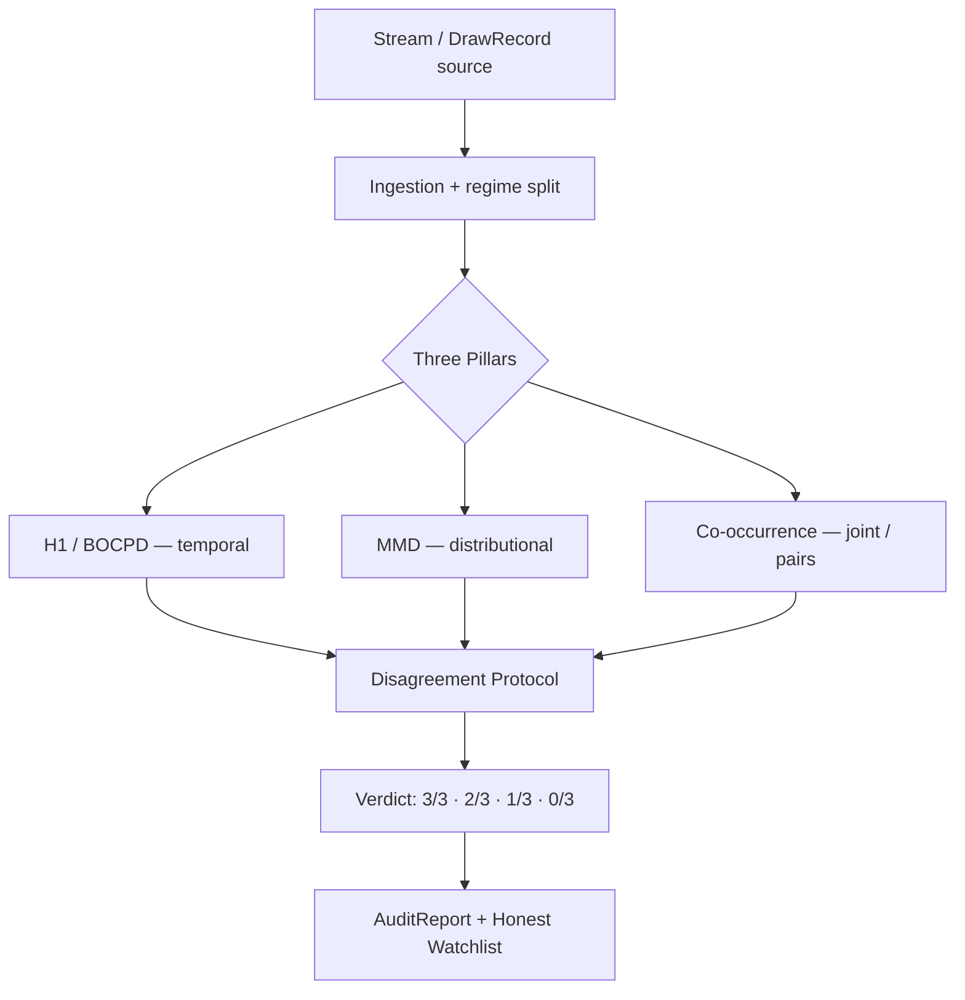

# BRIEF dla Claude Code — przepisanie `README.md` projektu DriftScope

> **Rola dla Ciebie (Claude Code):** Jesteś master-dev Python (20 lat), matematyk i statystyk,
> a jednocześnie osoba, która rozumie marketing portfolio. Masz dostęp do **całego repo**.
> Twoim zadaniem jest napisać **jeden, finalny `README.md`** — taki, który w 15 sekund chwyta
> laika/rekrutera, a po zejściu w głąb daje statystykowi/seniorowi dowód, że nic nie jest
> naciągane. Ten plik to brief: zawiera diagnozę obecnego README, syntezę pięciu zewnętrznych
> recenzji (DeepSeek, Qwen, Gemini, GPT, Kimi), oraz **twarde polecenia weryfikacji w kodzie**,
> których żaden z recenzentów nie mógł wykonać, bo nie miał dostępu do plików.

---

## 0. Najważniejsza zasada: WERYFIKUJ, NIE ZGADUJ

Pięć modeli recenzowało README **bez dostępu do kodu**. Ty masz dostęp. Dlatego przed napisaniem
czegokolwiek **musisz potwierdzić każdą liczbę i każdy claim w źródle**. To jest projekt, którego
cała wartość polega na *uczciwości metodologicznej* — README, które przekłamuje własne liczby,
zabija tę wartość natychmiast. Eksperci to wyłapią.

**Obowiązkowa checklista weryfikacyjna przed pisaniem** (zajrzyj do plików, nie wierz README):

1. **Liczba losowań.** README mówi „958 draws (2012–2026)". Sprawdź `data/seed/eurojackpot_history.csv`
   (policz wiersze) oraz loader w `ingestion/`. Potwierdź też podział na regimy R1=133, R2=389,
   R3=436 (suma = 958 — sprawdź czy się zgadza i czy logika splitu w kodzie to potwierdza).
2. **Daty change-pointów.** „2014-11-28" i „2022-03-29" — znajdź w `pipeline.py` / wynikach /
   testach, czy te daty są faktycznie zwracane, czy to wartości oczekiwane w teście.
3. **Liczba testów.** README mówi „260 tests". Uruchom/policz realnie (`pytest --collect-only`
   lub policz funkcje `test_`). Podaj **prawdziwą** liczbę. Jeśli to nie 260 — popraw.
4. **Liczba hipotez FDR.** README w jednym miejscu mówi „150 hypotheses", a w userowym kontekście
   pojawiało się „300 per-number + 12 global". **Sprawdź w `methodology/multiple_testing.py` i
   w pipeline, ile faktycznie hipotez jest korygowanych i jaką metodą (BH vs Benjamini-Yekutieli).**
   To rozbieżność, którą MUSISZ rozstrzygnąć z kodu, nie z README.
5. **Metryki wydajności.** README podaje tylko „~4 GB RAM". GPT i Kimi słusznie to punktują jako
   za mało. **Zmierz realny czas pełnego audytu** (`time driftscope run`) na bundlowanym CSV
   i podaj: runtime (s), peak RAM, liczbę permutacji (`--n-perm` default). Jeśli nie możesz
   zmierzyć wiarygodnie — napisz przedział i zaznacz warunki (CPU, n_perm), nie zmyślaj punktu.
6. **Numba speedup.** W kontekście projektu pojawiał się „2.71× zweryfikowany, 10–30× oczekiwany
   dla MMD O(N²)". Jeśli w repo jest benchmark/PoC potwierdzający — możesz go użyć jako konkret.
   Jeśli nie ma dowodu w kodzie — **nie podawaj liczby**, napisz ogólnie „JIT hot loops".
7. **LZ76 p ≈ 0.75** i **„P ≈ 14%"** dla R2 — potwierdź źródło tych liczb (test/wynik), zanim je
   zacytujesz.
8. **Stack i wersje.** „Numba 0.65.1", „NumPy 2.x", „Python 3.10" — sprawdź `pyproject.toml`
   (single source of truth, zgodnie z konwencją projektu). Podawaj wersje stamtąd.
9. **Streamlit demo / Quarto / `--hook` .webm** — potwierdź, że te ścieżki i komendy istnieją
   (`demo/app.py`, `report.qmd`, flagi w `cli.py`). Nie obiecuj w README funkcji, której nie ma.
10. **Linki live** (`piotr1686.github.io/DriftScope/`) — zostaw, ale jeśli w repo jest workflow
    GitHub Pages, potwierdź że deploy istnieje.

**Reguła:** każdą liczbę, która trafia do README, musisz móc wskazać palcem w pliku. Jeśli czegoś
nie da się potwierdzić — albo to zmierz, albo usuń, albo oznacz jako przybliżenie z warunkami.
Lepiej mniej liczb, ale wszystkie żelazne.

---

## 1. Diagnoza obecnego README (zgoda 5/5 recenzentów)

Wszystkie pięć modeli zbiega się do tej samej diagnozy, i ja ją podzielam:

- **Merytoryka: bardzo wysoka** (pre-registration, kalibracja FPR≈α, Benjamini-Yekutieli,
  manifest SHA-256, ground truth, PRNG benchmark, honest null). To jest top ~5% projektów
  portfolio. **Tego nie wolno rozcieńczyć.**
- **Marketing/czytelność: słaba.** README „sprzedaje metodologię, a nie autora" (trafna teza GPT).
  Pierwsze zdanie („stationarity audit framework for streaming discrete-valued processes — with
  calibrated detector hallucination rates") zabija laika w 10 sekund. Żargon (BOCPD, MMD,
  Benjamini-Yekutieli, DoD-1…6) wchodzi za wcześnie, bez wprowadzenia.
- **Brak lejka.** Nie ma struktury „laik → PM → inżynier → statystyk". Wszyscy proszą o
  *inverted pyramid* / *T-shaped*.
- **Brak warstwy wizualnej.** Zero diagramów. Wszyscy (najmocniej GPT, Kimi) żądają diagramu
  architektury i diagramu 3 filarów.
- **Brak „co JA zbudowałem".** Rekruter chce wiedzieć, co zrobił *autor*, nie co „framework robi".
- **Brak metryk wydajności** poza RAM.
- **Słabo wyeksponowane zastosowania poza loterią** — choć to największy realny atut komercyjny.

---

## 2. Synteza pięciu recenzji — co wziąć, a wobec czego być ostrożnym

### 2.1 Tezy, które przyjmujemy (konsensus + słuszne)

- **Hero / 30-second pitch na górze** (wszyscy). Jedno mocne zdanie + 3 punkty dowodu + linki live.
- **Sekcja „Highlights / Performance at a glance"** (GPT, Kimi) — bullet z konkretami: liczba
  losowań, RNG families, syntetyczne defekty, liczba testów, reprodukowalność, FDR, runtime.
- **Diagram architektury + diagram 3 filarów** (GPT, Kimi) — w Mermaid (renderuje się na GitHubie).
- **Sekcja „What I built / Co zbudowałem"** (GPT) — lista komponentów = zakres kompetencji.
- **Metafora 3 detektorów jako 3 niezależnych sędziów/ekspertów** (DeepSeek, Qwen, Gemini) —
  świetny sposób na wyjaśnienie Disagreement Protocol laikowi bez wzorów.
- **„Test krwi dla algorytmów" / „szczur laboratoryjny"** (Kimi, Gemini) — natychmiast rozbraja
  obawę „to projekt o lotto". Użyj tej narracji, ale trzymaj disclaimer „to NIE jest predyktor".
- **Tabela porównawcza vs NIST STS / Dieharder / CUSUM** (DeepSeek) — DOBRA, ale **tylko jeśli
  jest uczciwa**. Patrz ostrzeżenie 2.2.
- **Sekcja „Beyond the lottery — use cases"** (wszyscy) — z naciskiem, że to wizja, nie
  zaimplementowane moduły. Pharma najbliżej autora (GPT to trafnie wskazał — wykorzystaj kontekst
  domenowy autora: analityka farmaceutyczna, monitoring CPP/CQA/PAT, drift parametrów tabletkowania).
- **Sekcja „Why you can trust it / Trust Framework"** zamiast suchej listy DoD (Kimi) — przekuj
  DoD-1…6 w gwarancje jakości, ale **zachowaj mapowanie do plików** (to jest dowód, nie marketing).
- **Doprecyzowania uczciwościowe Kimiego (sekcja 4)** — to najcenniejszy wkład ze wszystkich
  recenzji. WDRÓŻ je:
  - „hallucination" = kontrolowany **Type I error / FPR**, kalibrowany Monte Carlo na shuffled
    null. Dodaj to wyjaśnienie przy pierwszym użyciu słowa.
  - „honest watchlist = None" = celowa **abstynencja decyzyjna**, nie pusta lista („nie wiem" vs
    „nie ma nic").
  - „does not hallucinate" → osłab do „w zakresie mocy testu przy α=0.05 i założeniach modelu".
  - EuroJackpot = **quasi-ground-truth** (proces fizyczny, nie idealny RNG; znane są *zmiany
    reguł ex ante*, nie idealna uniformność).
  - Doprecyzuj kontekst „~4 GB RAM" (dla pełnego audytu 958 draws, nie dla streamu).

### 2.2 Tezy, wobec których bądź OSTROŻNY / zweryfikuj zanim użyjesz

- **Tabela porównawcza vs NIST STS / Dieharder (DeepSeek).** Atrakcyjna, ale ryzykowna: NIST STS
  i Dieharder to dojrzałe, szanowane pakiety. Stwierdzenia typu „NIST: kontrola FDR — Nie" mogą
  być technicznie naciągane (NIST STS ma własne podejście do wielu testów). **Jeśli ją dodajesz:**
  (a) ogranicz się do osi, które są faktycznie prawdziwe i bezsporne (np. „dedykowany detektor par
  współwystępujących", „negatywna kontrola na realnych danych z ground truth", „abstynencja
  decyzyjna"); (b) sformułuj jako „czym DriftScope się różni / co dokłada", a NIE „DriftScope jest
  lepszy"; (c) nie pozycjonuj jako zamiennika NIST/Dieharder — pozycjonuj jako *komplementarne,
  framework-level audit z ground-truth walidacją*. Pokora tutaj buduje wiarygodność.
- **„Architektura odporna na halucynacje" / porównania do Byzantine Fault Tolerance (Gemini).**
  BFT to mocna analogia, ale Disagreement Protocol to **nie** konsensus odpornościowy w sensie
  rozproszonym — to ortogonalne rodziny detektorów. Użyj analogii „trzech niezależnych testów,
  z których każdy widzi inną klasę odchylenia", a unikaj sugerowania, że to system distributed-
  consensus. Nie naciągaj.
- **„poziom NASA", „poziom blockchain" (Kimi).** Pomijaj te superlatywy. Reprodukowalność
  bit-identyczna obroni się sama jednym zdaniem + linkiem do manifestu. Hiperbola obniża zaufanie
  eksperta.
- **Roadmapa z konkretnymi datami / `[x] PyPI Q2 2026` (DeepSeek).** NIE oznaczaj rzeczy jako
  zrobione, jeśli nie są w repo. Roadmapa = „planned / exploratory", bez fałszywych checkboxów.
- **Buzzwordy WASM/Kafka/Ray/mikroserwisy (Gemini, Kimi, DeepSeek).** Dobre jako *wizja rozwoju*,
  ale wyraźnie oddzielone od „co jest teraz". Nie sugeruj, że istnieje streaming backend, jeśli
  pipeline jest batch (sprawdź `pipeline.py`!).
- **Dwie ścieżki kariery DS vs Architect (Gemini).** Wartościowa myśl strategiczna, ale README to
  nie miejsce na dwariantowanie tożsamości autora. Zrób **jeden** spójny profil „interdyscyplinarny
  R&D / Statistical Research Engineer" (zgodnie z realnym profilem autora: pharma analytical + AI/ML).
  Sekcję „About the author" trzymaj krótką i konkretną.

---

## 3. Docelowa struktura README (lejek — zaimplementuj dokładnie w tej kolejności)

```
1.  Hero            — nazwa + 1 zdanie pitch + badge CI + 3 linki (live report, exec summary, demo)
2.  The 30-sec pitch — dla laika: jaki problem, czemu trudny, czemu ważny (NIE "co to robi")
3.  Highlights      — bullet-box konkretów (zweryfikowane liczby!) ✅✅✅
4.  How it works    — 3 filary jako 3 sędziowie + DIAGRAM Mermaid (3 pillars → Disagreement → verdict)
5.  The proof       — EuroJackpot (pozytywna + negatywna kontrola) skondensowane, z disclaimerem
                      „to nie predyktor / quasi-ground-truth"; link do raportu i (jeśli jest) figura
6.  Sensitivity     — PRNG benchmark (tabela): milczy na crypto, zapala się na planted defects,
                      WZÓR zapaleń = rodzaj defektu. + LZ76 jako supplement (nie 4. filar)
7.  Why trust it    — Trust Framework (DoD-1…6 przekute w gwarancje, z mapowaniem do plików)
                      + doprecyzowania uczciwościowe (FPR=hallucination, abstención=None, quasi-GT)
8.  Architecture    — DIAGRAM przepływu danych (Mermaid) + uzasadnienie stacku (Polars/Numba/why)
9.  Performance     — at a glance: runtime, peak RAM, n_perm, liczba testów (ZMIERZONE)
10. What I built    — lista komponentów (zakres kompetencji autora)
11. Beyond the lottery — use cases (pharma first, potem fintech/cybersec/IoT/MLOps) — jako WIZJA
12. Quickstart      — install + 1 komenda (zachowaj obecne, jest czyste; potwierdź flagi)
13. Project layout  — drzewo (zachowaj, zaktualizuj jeśli kod się różni)
14. Roadmap         — planned/exploratory, BEZ fałszywych "done"
15. About the author + License
```

**Zasada lejka:** im niżej, tym gęściej technicznie. Laik dostaje wartość z sekcji 1–5, mid-dev
z 4–10, statystyk/senior z 5–9 i 14. Nikt nie jest zmuszony czytać żargonu, żeby zrozumieć pointę.

---

## 4. Diagramy do wygenerowania (Mermaid — renderuje się natywnie na GitHubie)

**Diagram A — przepływ danych (sekcja Architecture):**


**Diagram B — co który filar widzi** (tabela już jest dobra; rozważ wersję wizualną pokazującą
„champion pillar" dla każdej klasy sygnału). Możesz zostawić tabelę + dodać 1 zdanie metafory.

Zweryfikuj nazwy węzłów względem realnych modułów (`pipeline.py` `run_audit`, `reporting/disagreement.py`).

---

## 5. Konkretne sformułowania uczciwościowe (wstaw je dosłownie lub blisko)

- Przy pierwszym „hallucination":
  > *W terminologii projektu „hallucination" = błąd I rodzaju (false positive), kalibrowany metodą
  > Monte Carlo na permutowanym (shuffled) nullu do poziomu α ≈ 0.05.*
- Przy „honest watchlist = None":
  > *`None` to celowa abstynencja decyzyjna („nie ma wystarczających przesłanek"), a nie pusta
  > lista i nie ekstrapolacja — kluczowa różnica między „nie wiem" a „nie ma nic".*
- Przy EuroJackpot:
  > *EuroJackpot traktujemy jako quasi-ground-truth: to proces fizyczny, nie idealny RNG. Pewne
  > są natomiast zmiany reguł (ex ante: 2014, 2022) i niezmienność puli 1–50 — i to one są
  > kontrolą.*
- Przy „does not hallucinate":
  > *…w zakresie mocy testu, przy α = 0.05 i założeniach modelu. To kalibrowana kontrola błędu,
  > nie absolutna gwarancja.*

---

## 6. Use cases poza loterią (sekcja 11) — uporządkowane wg wiarygodności dla autora

Kolejność celowa: zaczynamy od domeny, w której autor jest realnie ekspertem (pharma — to dodaje
wiarygodności całej liście), potem branże o największym „pull" rekruterskim.

1. **Pharma / Analytical Development (najbliżej autora — wyeksponuj).** Monitoring stabilności
   procesu (granulacja, tabletkowanie), drift CPP/CQA, dane PAT — wykrycie zmiany rozkładu
   twardości/rozpadu/wilgotności *zanim* parametr przekroczy specyfikację. Honest null = brak
   fałszywych wezwań / fałszywych OOS-trendów.
2. **MLOps — data drift / concept drift** (GPT trafnie: najlepszy „pull"). DriftScope jako
   audytor driftu między danymi treningowymi a produkcyjnymi, z kontrolą FDR.
3. **FinTech / trading — regime shifts**, audyt „random walk", detekcja manipulacji (spoofing,
   wash trading) — filar co-occurrence dla korelacji par.
4. **Cyberbezpieczeństwo** — drift w ruchu sieciowym/logach, C2 beaconing, anomalie współwystąpień
   (filar co-occurrence), LZ76 dla ukrytych wzorców w rzekomo losowym ruchu.
5. **IoT / Industry 4.0 — predictive maintenance**, sensor drift przed awarią; honest null
   redukuje fałszywe alarmy.
6. **Gaming / regulowany hazard** — audyt RNG slotów, zgodność loot-boxów z deklarowanymi
   drop-rate (regulacje UE/USA).

Każdy punkt: 1–2 zdania, oznaczone jako **wizja zastosowań** (engine jest detektorem zmian w
rozkładach dyskretnych → naturalnie przenośny), nie jako zaimplementowane integracje.

---

## 7. Roadmap (sekcja 14) — bez fałszywych „done"

Zaproponuj 4–6 realnych kierunków, wszystkie jako planowane/eksploracyjne:
- detektor dla strumieni ciągłych (Gaussian-kernel MMD) — most do sensorów/finansów,
- tryb online z forgetting factor (BOCPD okienkowy) — most do streamu,
- adapter strumieniowy (Kafka/Redpanda) — wyraźnie „planned", bo obecnie batch (POTWIERDŹ w kodzie),
- pakiet PyPI z prostym API `audit_stream(...)`,
- FastAPI + JSON verdict (`{verdict, regime, timestamp}`),
- arXiv note z pełną analizą mocy i porównaniem do NIST STS.

Nie stawiaj `[x]` przy niczym, czego nie ma w repo.

---

## 8. Ton, język, długość

- **Dwujęzyczność:** README głównie **po angielsku** (portfolio międzynarodowe, rekruterzy
  quant/big-tech). Autor pracuje PL+EN — jeśli chce, można dodać 1-zdaniowy link do wersji PL,
  ale domyślnie EN.
- **Proza, nie ściana bulletów.** Sekcje narracyjne (pitch, proof, trust) pisz prozą; bullety
  tylko dla Highlights, tabel i list komponentów.
- **Bez hiperboli** („NASA", „genialne", „rewolucyjne"). Liczby i mapowanie do plików robią
  robotę same.
- **Emoji:** oszczędnie, tylko w Highlights/linkach (✅ 📊 📄), nie w prozie technicznej.
- **Długość:** README może być dłuższe niż obecne (lejek wymaga miejsca), ale każda sekcja musi
  zarabiać na swoje istnienie. Tnij powtórzenia.

---

## 9. Czego ABSOLUTNIE nie ruszać (bo jest prawdziwe i imponujące)

- Kalibracja FPR ≈ α = 0.05 z walidacją permutacyjną.
- Kontrola FDR (BH / Benjamini-Yekutieli) — z PRAWDZIWĄ liczbą hipotez (zweryfikuj 150 vs 300+12).
- Reprodukowalność bit-identyczna (SHA-256 manifest, seed z zawartości danych).
- Pozytywna + negatywna kontrola na EuroJackpot z ground-truth.
- PRNG benchmark (crypto clear, planted defects flagged, wzór zapaleń = typ defektu).
- Pre-registration z podziałem clean vs data-informed.
- Disagreement Protocol jako zbiór ortogonalnych rodzin.
- LZ76 jako *supplement*, nie 4. filar.

---

## 10. Definicja sukcesu (kryteria akceptacji nowego README)

Nowy `README.md` jest gotowy, gdy:

1. **Każda liczba** w pliku ma pokrycie w repo (zweryfikowana, nie przepisana z poprzedniego README).
2. Laik rozumie w 15 s, że to „instrument do wykrywania zmian w danych, który nie zmyśla sygnałów".
3. Są **co najmniej 2 diagramy Mermaid** (architektura + 3 filary/przepływ decyzji).
4. Jest sekcja Highlights, Performance-at-a-glance (ze zmierzonymi metrykami), What I built,
   Trust Framework, Use cases, Roadmap, About the author.
5. Wszystkie doprecyzowania uczciwościowe z §5 są wstawione.
6. Żaden claim nie sugeruje funkcji nieistniejącej w kodzie (streaming, PyPI-done, itp.).
7. Tabela porównawcza (jeśli jest) jest sformułowana jako „różnice/komplementarność", nie „jesteśmy
   lepsi od NIST".
8. Disclaimer „to NIE jest predyktor loterii" jest widoczny wcześnie i jednoznaczny.
9. Statystyk czytający całość nie znajduje ani jednego naciąganego wniosku.

---

### Kolejność pracy dla Ciebie, Claude Code

1. Przejdź checklistę §0 — zbierz/zmierz wszystkie liczby z kodu. Zapisz je sobie.
2. Rozstrzygnij rozbieżność liczby hipotez FDR (150 vs 300+12) i liczby testów z faktycznego kodu.
3. Zmierz runtime/RAM realnym uruchomieniem (jeśli środowisko pozwala).
4. Napisz README wg struktury §3, wstawiając diagramy §4 i sformułowania §5.
5. Na końcu przejdź kryteria akceptacji §10 jak listę kontrolną — każdy punkt musi być spełniony.
